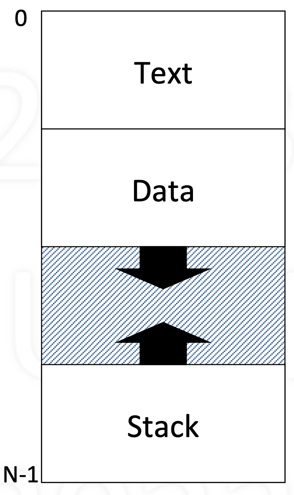

# TOC
- [TOC](#toc)
- [Main](#main)
  - [Process](#process)
    - [Basic Resouce for a process](#basic-resouce-for-a-process)
    - [Context of a Process](#context-of-a-process)
    - [Process Memory Structure](#process-memory-structure)
    - [Process Stack](#process-stack)
  - [Multiprogramming](#multiprogramming)
    - [Goal: Support Multiple Processes](#goal-support-multiple-processes)
    - [Multiprogramming](#multiprogramming-1)
  - [Yield](#yield)
    - [Context Switching](#context-switching)
    - [Simple Context Switching](#simple-context-switching)
    - [The “magic” of Yield](#the-magic-of-yield)
    - [Yielding via the Kernel](#yielding-via-the-kernel)

# Main

##  Process
  - Abstraction of a running program
  - Dynamic: has state, changes. Whereas a program is static

### Basic Resouce for a process
  - CPU
    - Processing cycles (time)
    - To execute instructions
  - Memory
    - Bytes or words (space)
    - To maintain state
  - Other resources (e.g., I/O)
### Context of a Process
  - Context: machine and kernel-related state
  - CPU context: values of registers
    - PC (program counter)
    - SP (stack pointer), FP (frame pointer), GP (general)
  - Memory context: pointers to memory areas
    -  Code, static variables (init, uninit), heap, shared, ...
    -  Stack of activation records
  - Other (kernel-related state, ...) 

###  Process Memory Structure
- Text
  - Code: program instructions
- Data
  - Global variables
  - Heap (dynamic allocation)
- Stack
  - Activition records
  - Automatic growth/shrinkage

    

###  Process Stack
- Stack of activation records
  - One per pending procedure
- An activation record may store
  - where to return to
  - link to previous record
  - automatic (local) variables
  - other (e.g., register values)
- Stack pointer points to top

## Multiprogramming
###  Goal: Support Multiple Processes
- Users would like to run multiple programs
  - “simultaneously”
  - Not all actively using the CPU
  - Some waiting for input, devices (e.g., disk), ...
- How to do this given single CPU?

###  Multiprogramming
- Given a running process
  - At some point, it needs a resource, e.g., I/O device
  - Say resource is busy, process can’t proceed
  - So, “voluntarily” gives up CPU to another process
- Yield (p)
  - Let process p run (voluntarily give up CPU to p)
  - Requires context switching

## Yield
###  Context Switching
- Allocating CPU from one process to another
  - First, save context of currently running process
  - Next, restore (load) context of next process to run
- Loading the context
  - Load general registers, stack pointer, etc.
  - Load program counter (must be last instruction!)
  
###  Simple Context Switching
- Two processes: A and B
- A calls Yield(B) to voluntarily give up CPU to B
- Save and restore registers
  - General-purpose, stack pointer, program counter
- Switch text and data
- Switch stacks
  - Note that PC is in the middle of Yield!

### The “magic” of Yield
```C
magic = 0;              // local variable
save A’s context:       // current process
    asm save GP;        // general purpose registers;
    asm save SP;        // stack pointer
    asm save PC;        // program counter, note value!
if (magic == 1) return;
else magic = 1;
restore B’s context:    // process being yielded to
    asm restore GP;
    asm restore SP;
    asm restore PC;     // must be last!
```

###  Yielding via the Kernel
- Yield routine is common code: put in kernel
- Process contexts are also in the kernel 
  - This way they are protected
  - Only needed by Yield routine anyway
- But what is the kernel?
  - code that supports processes
  - runs as an extension of current process
- Has text, data, and multiple stacks

