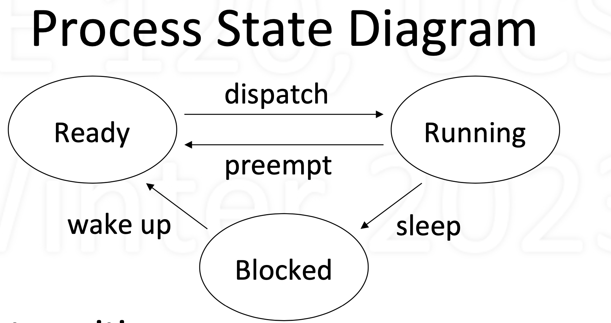

# TOC
- [TOC](#toc)
- [Main](#main)
  - [Timesharing](#timesharing)
    - [Implementation of Timesharing](#implementation-of-timesharing)
    - [Timesharing state transitions](#timesharing-state-transitions)
  - [Kernal on process](#kernal-on-process)
    - [Process vs. Kernal](#process-vs-kernal)
    - [Kernel Maintains List of Processes](#kernel-maintains-list-of-processes)
    - [How kernal get control](#how-kernal-get-control)
    - [How a Context Switch Occurs](#how-a-context-switch-occurs)
  - [Thread](#thread)
    - [How to Get Parallelism in Process](#how-to-get-parallelism-in-process)
    - [Thread](#thread-1)
    - [Implementing Threads](#implementing-threads)
    - [User-Level Threads](#user-level-threads)
    - [User-level vs. Kernal-level](#user-level-vs-kernal-level)

# Main
## Timesharing
- Timesharing: multiplexing use of CPU over time
- Multiple processes, single CPU (uniprocessor)
- Conceptually, each process makes progress over time 
- In reality, each periodically gets quantum of CPU time 
- Illusion of parallel progress by rapidly switching CPU

### Implementation of Timesharing
- Kernel keeps track of progress of each process
- Characterizes state of process’s progress
  - Running: actually making progress, using CPU
  - Ready: able to make progress, but not using CPU 
  - Blocked: not able to make progress, can’t use CPU
- Kernel selects a ready process, lets it run
  -  Eventually, the kernel gets back control
  -  Selects another ready process to run, ...

### Timesharing state transitions

- Dispatch: allocate the CPU to a process 
- Preempt: take away CPU from process
- Sleep: process gives up CPU to wait for event
- Wakeup: event occurred, make process ready

## Kernal on process

### Process vs. Kernal
- Kernel: code that supports processes 
  - system calls: fork ( ), exit ( ), read ( ), write ( ), ...
  -  management: context switching, scheduling, ...
- When does the kernel run?
  - when system call or hardware interrupt occurs
-  The kernel runs as part of the running process
   -  due to that process having made a system call
   -  in response to device issuing interrupt

###  Kernel Maintains List of Processes
- All processes: unique names (IDs) and states
- Other info kernel needs for managing system 
  - contents of CPU contexts
  - areas of memory being used
  - reasons for being blocked
- Example

  |Process ID |State | Other info|
  | --- | --- | ---|
  |1534 | Ready | Saved context, ...
  |34 | Running | Memory areas used, ...
  | 487 | Ready | Saved context, ...
  |9 | Blocked | Condition to unblock, ...

### How kernal get control
- Process can give up control voluntarily
  - Makes system call that blocks, e.g., read ()
  - System-call function calls yield () to give up CPU 
  - Kernel selects a ready process, dispatches it
- Or, CPU is forcibly taken away: preemption
  - Interrupt generated when hardware timer expires 
  - Interrupt forces control to go to kernel
  - While kernel running, resets timer for next time

###  How a Context Switch Occurs
- Process makes system call or interrupt occurs
- What’s done by hardware
  - Switch from user to kernel mode: amplifies power 
  - Go to fixed kernel location: trap/interrupt handler
- What’s done in software (in the kernel) 
  - Save context of current process
  - Select a process that is ready; restore its context
  -  RTI: return from interrupt/trap

## Thread
###  How to Get Parallelism in Process
- Process is a “program in execution”
  - assumed (so far) a single path of execution 
  - in a memory composed of text, data, stack
- What if we want multiple paths of execution? 
  -  Single text, but multiple executions in parallel
  -  Single data, any execution can see others’ updates
  -  Need separate stacks: one per ongoing execution
-  Multiple processes? No (separate memories)

###  Thread
- Thread: single sequential path of execution
- Abstraction is independent of memory
  - Contrast to process: path of execution + memory
-  A thread is part of a process
   -  Lives in the memory of a process
   -  Distinction allows multiple threads in a process
- To the user: unit of parallelism
- To the kernel: unit of schedulability

### Implementing Threads
- Thread calls are system calls
  - ForkThread (): like process Fork () but for threads 
  - Thread system call functions are in kernel
- Thread management functions are in kernel 
  - Thread context switching
  - Thread scheduling
- Each thread requires user and kernel stacks
- Kernel can schedule threads on separate CPUs

###  User-Level Threads
- Can support threads at user level
- Included via thread library
- Thread calls at user level – ForkThread (), YieldThread (), ...
- Thread Management at user level
- Supports threads regardless of kernel support
- However, no true parallelism

### User-level vs. Kernal-level
- User-level threads
  - Portability: works on any kernel
  - Efficient: thread-switching occurs in user space
  - User can decide on scheduling policy
  - But no true parallelism (without special support)
- Kernel-level threads
  - Can achieve true parallelism
  - Overhead: thread switch requires kernel call
- Two important questions
  - Is thread support part of user or kernel code?
    - For user-level thread, it's supported by the library
    - For kenal-level thread, it's supported by the kernel code
  - Is thread running in user or kernel space?
    - It could run in userspace or it could run in kernel space regardless it's a user level thread or a kernel level thread

Assume we have three threads:
$$A:=[a1,a2,a3],B:=[b1,b2,b3],C:=[c1,c2,c3]$$
- If we want to make it a kernel-level thread, then:
  |user-space|kernel-space|
  |---|---|
  |[A][B][C]|[A][B][C]|

- If we want to make it a user-level thread, then:
  |user-space|kernel-space|
  |---|---|
  |[A][B][C]|[[A][B][C]]|