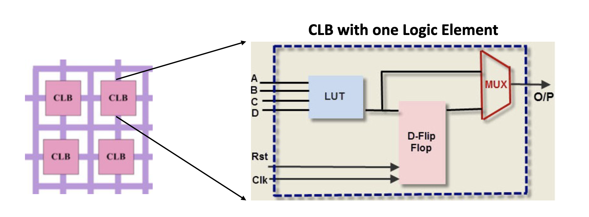
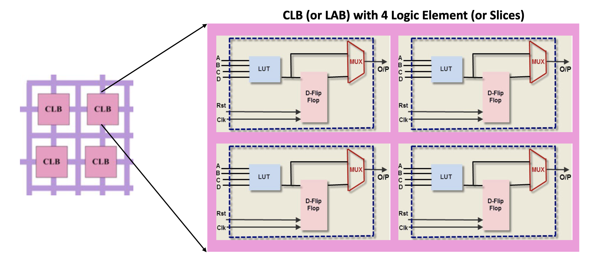
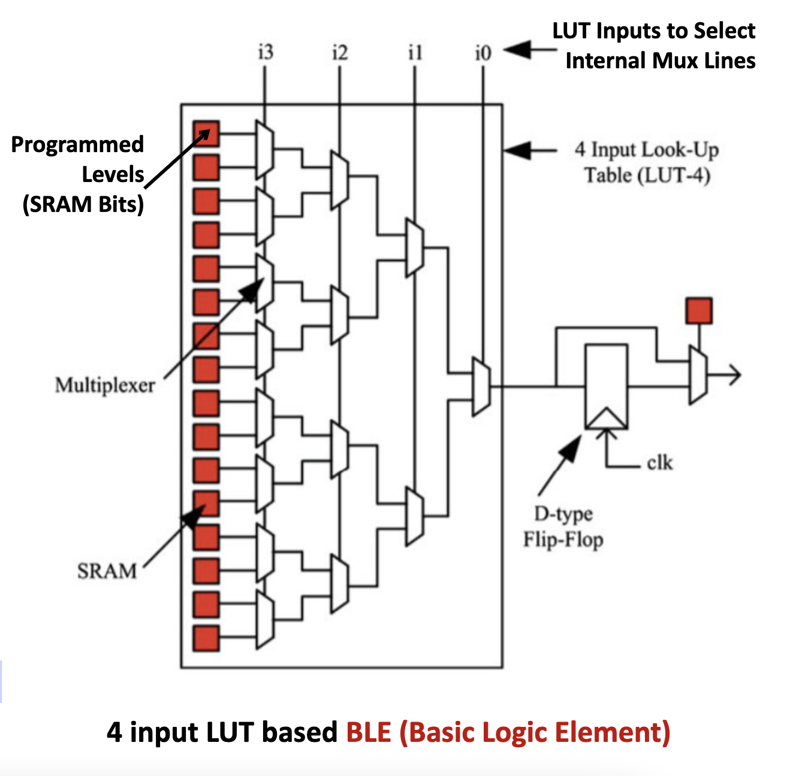
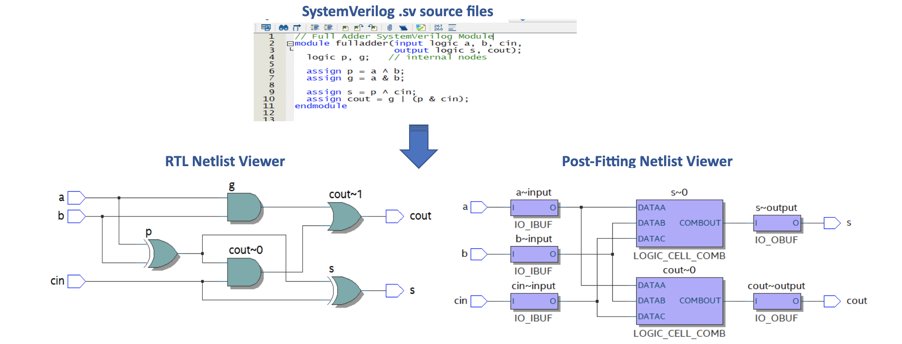
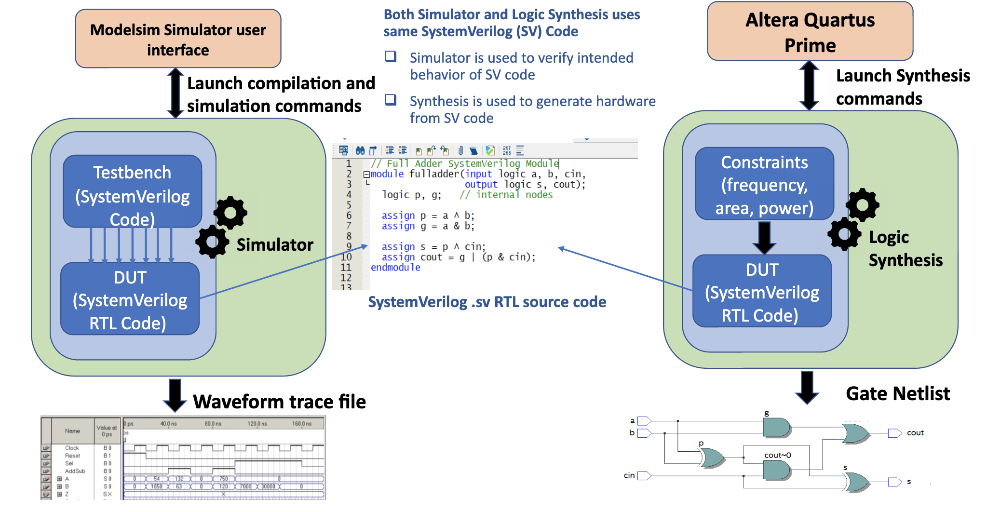

# Lecture 02

##  Table of contents
- [Lecture 02](#lecture-02)
  - [Table of contents](#table-of-contents)
  - [Main](#main)
    - [Netlist](#netlist)
    - [FPGA](#fpga)
      - [CLB](#clb)
      - [Typical LE (BLE) Example](#typical-le-ble-example)
      - [LUT (Look Up Table) Operation](#lut-look-up-table-operation)
      - [Modern FPGA](#modern-fpga)
      - [FPGA Design Flow](#fpga-design-flow)
      - [FPGA Netlist Viewer](#fpga-netlist-viewer)
    - [FPGA vs ASIC Comparison](#fpga-vs-asic-comparison)
    - [Logic Synthesis](#logic-synthesis)
      - [ASIC Logic Synthesis Flow Details](#asic-logic-synthesis-flow-details)
      - [FPGA Synthesis](#fpga-synthesis)
    - [Simulator](#simulator)

---

##  Main
###  Netlist
- Definition
  - If vertices are gates, then netlist is called a gate level netlist
  - If vertices are transistors, then netlist is called a transistor level netlist
  - If vertices are modules, then netlist is called a 
  SystemVerilog level netlist
- Synthesis: Netlist can be transformed from one level using a process known as “Synthesis”
  - Logic Synthesis: Converts HDL netlist to gate-level netlist representation of design
  - Physical Synthesis : Converts gate-level netlist to 
transistor level netlist

### FPGA
- Definition: Field programmable Gate Arrays (FPGAs) are 
pre-fabricated silicon devices that can be 
electrically programmed in the field to become 
almost any kind of digital circuit or system. 
- FPGA Comprises of :
  - Programmable Logic Block (CLB or LAB) 
which implement logic functions
  - Programmable routing that connects these 
logic functions
  - I/O blocks that are connected to logic 
blocks through routing interconnect
- Each CLB contains one or more Logic Elements 
(LE) connected over interconnect
    - Each LE consists of k-input LUT’s (Look up 
tables) and Flipflop
    - Hard Blocks : DSP’s, Multipliers, Adders 
PCIe, Serdes
- FPGA Vendors:
  - Xilinx, Altera, Actel, Microsemi, Lattice, 
QuickLogic 

#### CLB
- CLB comprises of one or more Logic Element (LE) connected over an interconnect
- Each LE contains:
  - Lookup Table (LUT)
  - D-Flip Flop
  - MUX which allows selection of either the LUT output or the D-Flip Flop output
  - Note : In Altera FPGA, a CLB is called as LAB (Logic Array Block) 

- CLB can contain multiple Logic Elements
  - In Xilinx FPGA Logic Elements are known as Slices
  - Higher the count of Logic Elements means more digital logic functions can be implemented inside an FPGA
    - In Altera Arria II GX FPGA devices there are 43,000 to 244,000 Logic Elements
    - In Altera Stratix 10 FPGA device family supports up to 5.5 Million Logic Elements

####  Typical LE (BLE) Example
- A typical LE comprises of a 4 input 
LUT (LUT-4) and a D-type Flip-Flop.
    - LUT consists of cascaded Multiplexors
    - LUT inputs are select lines for internal 
multiplexors (MUX)
    - The LUT-4 uses 16 SRAM bits to 
implement any 4 inputs boolean 
function. 
    - The output of LUT-4 is connected to 
an optional Flip-Flop. A multiplexor 
selects the BLE output to be either 
the output of a Flip-Flop or the LUT-4
- Modern FPGAs contain typically 4 to 
10 BLEs in a single cluster

####  LUT (Look Up Table) Operation
- LUT can implement any Boolean expression
- LUT is made up of two main components :
  - Series of cascaded multiplexer(s)
  - SRAM cells to program input values
- LUT inputs are used as select lines to 
multiplexer
- Input to multiplexer is programmed to logic 
0 or 1  (these are programmed levels stored 
in SRAM)
- logic is called a look up table because output 
is selected by looking at correct 
programming levels and input select lines
- Example on this slide is 3-to-1 LUT 
implementing a boolean expression : 
    - $p = ab + b(!c)$

####  Modern FPGA
- Modern FPGAs have many built-in interfaces.
  - DRAM
  - PCIE
  - USB
  - SATA
  - and more

- Makes them easy to integrate into 
compute environments
- Contains specific purpose hard blocks
  - Includes memory, multipliers, adders, DSP 
blocks, Quad core ARM CPU’s and more
  - Hard blocks are very efficient at implementing 
specific functions as they are designed optimally 
to perform these functions, yet they end up 
wasting huge amount of logic and routing 
resources if unused

####  FPGA Design Flow
FPGA ImplementationFPGA Implementation:
- Mapping
  - Compares the resources specified in input synthesized netlist and checks for available resources of the 
target FPGA
      - Insufficient resources will result in errors  
    - Divides the netlist circuit into sub-blocks to fit into FPGA logic blocks
- Place and Route
  - Also known as design fitting. This is the most challenging and intensive part of FPGA design flow
  - Physically places the sub-blocks in netlist generated from mapping stage to FPGA logic blocks
  - Routes signals between logic blocks considering timing constraints
  - FPGA tools provides choices to user to specify fitting criteria’s and based on that logic will be mapped to 
FPGA resources. These fitting criteria's are:
    - High performance (speed), Smallest area, Low power, Balanced
- Generate programming file
  - Generate bitstream file or IEEE-1532 configuration file (.isc). 
  - Download to FPGA either through JTAG or downloaded to non-volatile memory on FPGA board which 
upon reset will automatically program FPGA 

#### FPGA Netlist Viewer
FPGA Tools provides netlist viewer post synthesis and implementation:
- RTL netlist viewer
- Post-fitting netlist viewer
- Post-mapping netlist viewer

### FPGA vs ASIC Comparison 
- FPGA
  - Advantages
    - Low Time-to-market
    - High flexibility
    - High reusability 
    - High IO count and massive parallelism
    - High NRE (Net Return of Engineering Cost)
  - Dis-advantages
    - Low Performance
    - High power consumption
    - High Area
    - Higher Cost (can cost 4K USD)
    - Cannot implement Analog blocks
  - Application : Whenever fast turnaround time required with 
performance tradeoff. HW (SOC/IP) prototyping to prove concept, 
validate design, early SW validation platform, FPGA based Clouds, ML

- ASIC
  - Advantages
    - High Performance
    - Low power consumption
    - Low Area
    - High volume production due to lower cost per 
unit
    - Can implement Analog blocks
  - Dis-advantages
    - High Time-to-market
    - Low flexibility
    - Low reusability
    - Low NRE
  - Application : High Speed designs, high packing 
density, used in larger numbers (CPU, Modern 
mobile chipsets, Analog devices, Gigabit Serdes, 
etc) 
### Logic Synthesis
- Logic synthesis is the process of converting HDL description of a design into an 
optimized structured gate-level representation using technology specific primitives:
    - Output of logic synthesis process is optimized and mapped gate-level netlist
    - For FPGAs it uses : LUTs, flip-flops, and RAM blocks
    - For ASICs it uses : Standard cell gates, flip-flop libraries, and memory blocks
    - Constraints are provided to synthesis tool to meet goals such as:     
        - Timing, area, performance, max dynamic transition for power,fanout
- Logic Synthesis Goals :
  - Minimize area: 
    - in terms of literal count, cell count, register count, etc
  - Minimize power:
    - in terms of switching activity in individual gates, deactivated circuit blocks, etc.)
  - Maximize performance:
    - in terms of maximal clock frequency of synchronous systems, throughput for 
asynchronous systems)
  - Combination of above:
    - “minimize area for clock speed >500Mhz”
  - Feedback from layout :
    - actual physical sizes, delays, placement and routing
#### ASIC Logic Synthesis Flow Details
  1. Translation
       - Check if design provided can be synthesized
       - Map RTL to unmapped gate-nelist
       - Uses standard GTECH library which as and, or, etc gates and designware 
library which has adders, comparators, etc primitives
  2. Optimization
        - Reduce logic
        - Eliminate redundant logic
        - Make design smaller and faster (best Fmax)
  3. Technology Mapping
        - Map gates to technology dependent standard cell and macros
        - Technology library is also known by transistor size (14nm, 20nm, 5nm)
  4. Optimization
        - Path equalization and re-sizing
        - Logic level power optimization and more
  5. Test logic insertion
        - Instertion of logic to support DFT (design for testability), such as scan chains

#### FPGA Synthesis
FPGA Synthesis is a 3-step process:
1. Design check and resource association
   - Check for syntax errors in design source files
   - Check if design provided can be synthesized
   - Associate design to logic cell and blocks
2. Optimization
   - Reduce logic
   - Eliminate redundant logic
   - Make design smaller and faster (best Fmax)
3. Technology Mapping
   - Connect design to logic
   - Predict and add timing estimates
   - Create output reports and netlists

###  Simulator
- Simulation is the process of verifying the functionality and timing of a design 
against its original specifications
    - Example : Does 32-bit ALU logic implemented using SystemVerilog perform 
operations such as addition, subtraction, multiplication, comparison correctly as per 
the intended specification ?
- Designers perform functional simulation using a simulator at various stages of 
design flow :
    - Prior to logic synthesis RTL simulation is performed to verify functionality of design
    - After synthesis, gate level simulation is performed on the netlist generated by 
synthesis.
        - Gate level simulation is performed to verify design timing and also re-check functionality of 
design

- Simulator role is approximating reality. Design realized in virtual environment !
  - Simulator creates an artificial universe that mimics the future real circuit design
  - It lets the designer interact with the design before it is manufactured, and enables 
designer to correct flaws and problem earlier
oSimulator takes SystemVerilog code or a gate level netlist and simulates design 
using stimulus provided in testbench code
oIt generates waveforms to provide approximate behavior of design prior to 
manufacturing.
   - Note : 
     - Simulator does not correct automatically incorrect description of the design written in 
HDL
    - It is the responsibility of verification engineer, not the simulator, to apply legal set of 
stimulus to design under test based on real world usecase.

