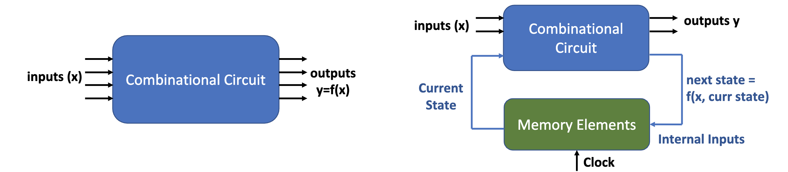
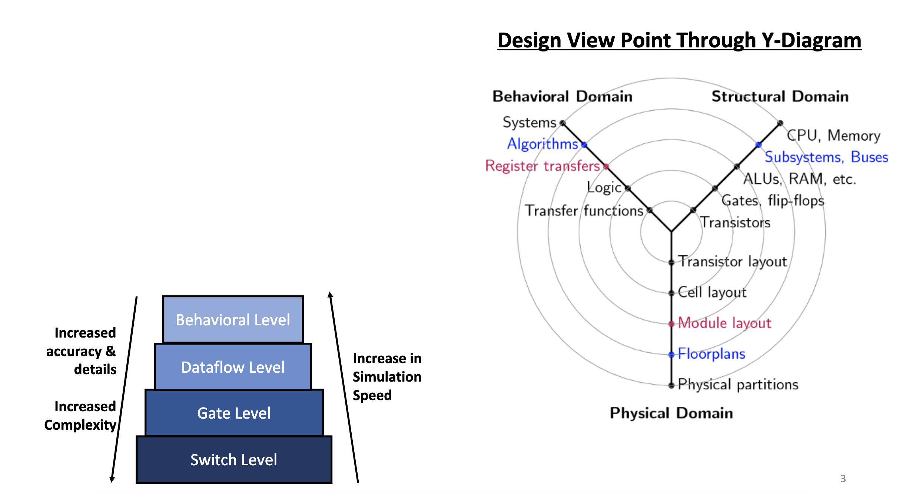
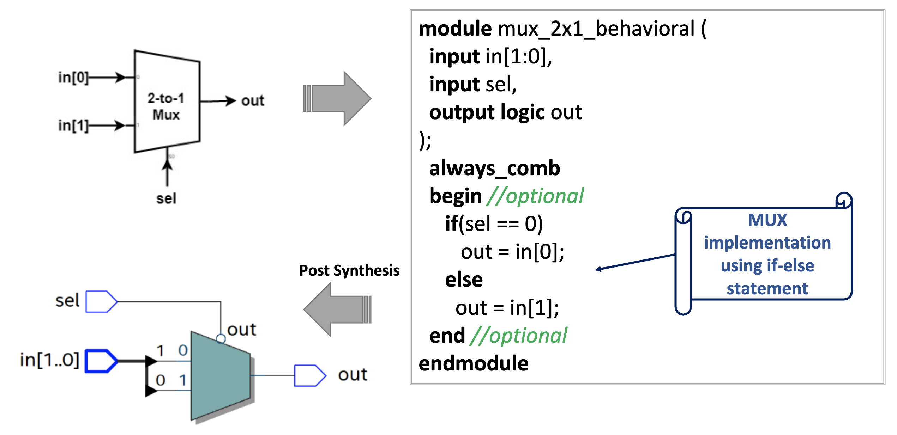
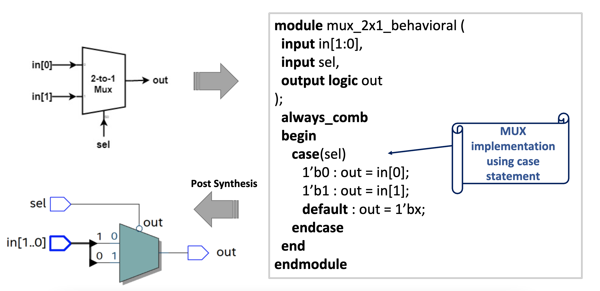
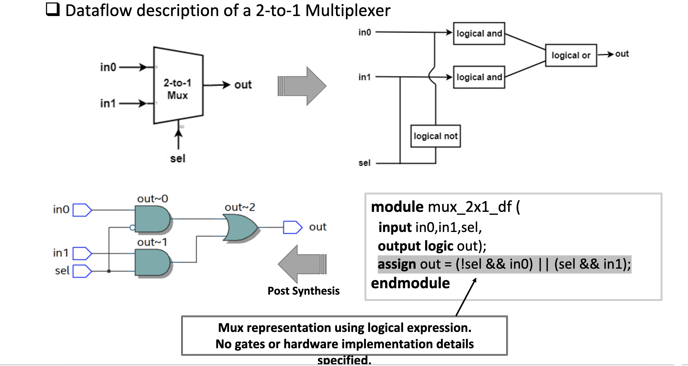
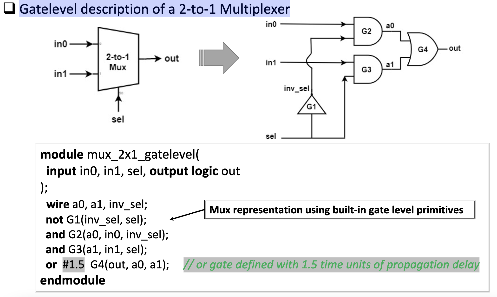
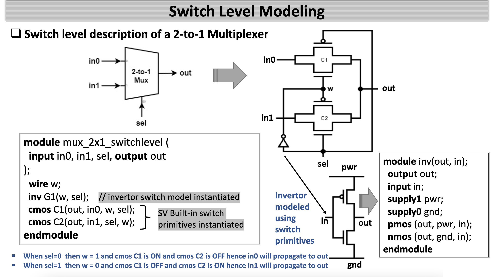

# Lecture 03&04
##  1. <a name='TOC'></a>TOC
<!-- vscode-markdown-toc -->
* 1. [TOC](#TOC)
* 2. [Meta](#Meta)
* 3. [Main](#Main)
	* 3.1. [Combinational vs Sequential Circuit](#CombinationalvsSequentialCircuit)
	* 3.2. [Modeling Styles in SystemVerilog](#ModelingStylesinSystemVerilog)
	* 3.3. [Behavioral Level Modeling](#BehavioralLevelModeling)
	* 3.4. [Dataflow Modeling](#DataflowModeling)
	* 3.5. [assign vs always_comb](#assignvsalways_comb)
	* 3.6. [Gate Level Modeling](#GateLevelModeling)
	* 3.7. [Time Unit](#TimeUnit)
	* 3.8. [Switch Level Modeling](#SwitchLevelModeling)
	* 3.9. [RTL (Register Transfer Level) Modeling](#RTLRegisterTransferLevelModeling)
	* 3.10. [Behavioral vs RTL Level Modeling](#BehavioralvsRTLLevelModeling)
	* 3.11. [Example: Decoder](#Example:Decoder)
	* 3.12. [Example: Full adder](#Example:Fulladder)

<!-- vscode-markdown-toc-config
	numbering=true
	autoSave=true
	/vscode-markdown-toc-config -->
<!-- /vscode-markdown-toc -->
##  2. <a name='Meta'></a>Meta
##  3. <a name='Main'></a>Main

###  3.1. <a name='CombinationalvsSequentialCircuit'></a>Combinational vs Sequential Circuit
- Combinational Circuit
  - At any instance of time present value of outputs 
depends solely on present value of inputs
  - Does not store any intermediate values and hence 
does not require any memory elements
  - Does not require any clock signal
  - Behavior is described by set of output functions
  - Examples: Full Adder, half adder, comparator, 
multiplexer, decoder, encoder, etc
- Sequential Circuit
  - Present values of outputs are determined from 
present values of inputs and past state (i.e. 
sequence of past inputs or known as past outputs)
  - Behavior is described by set of output functions 
and set of next states functions stored in memory
  - It contains memory elements to store past outputs 
and requires clock signals
  - Examples: Flipflop, Latch, Shift Register, etc



###  3.2. <a name='ModelingStylesinSystemVerilog'></a>Modeling Styles in SystemVerilog
- SystemVerilog modeling language supports 
three kinds of modeling styles: 
    - Behavioral level (Algorithmic or RTL level)
    - Dataflow level
    - Gate level (Structural level)
    - Switch level (Transistor level)

- RTL (Register Transfer Level) model utilizes 
combination of  behavioral and dataflow styles


###  3.3. <a name='BehavioralLevelModeling'></a>Behavioral Level Modeling
- Hardware circuit is specified in terms of its expected behavior or an algorithm 
without concern of internal hardware implementation
  - Full functionality of a complex circuit specified in C type natural language description
  - It is not a cycle accurate representation of hardware circuit
  - It may contain algorithms, boolean equations, truth tables (Tables of input and 
output values)
  - Models at this abstraction level are also called as bus-functional or algorithmic 
models
  - This is the highest level of abstraction provided by SystemVerilog HDL
  - It is primarily used to model sequential circuits, but can also be used to model pure 
combinatorial circuits
- Advantage
  - Behavioral models are faster to simulate compared to gate level models since it has 
less timing details
- Most of the behavioral modeling is done using two important constructs: 
initial and always. 
    - All the other behavioral statements appear only inside initial and always blocks
    - A module may contain an arbitrary number of initial or always blocks and may 
contain one or more procedural statements within them. 
    - All of the initial and always blocks execute concurrently (i.e. to model parallelism)
- Behavioral model even though mimics the intended hardware behavior but it 
may not be necessarily synthesizable
---

Behavioral level description of a 2-to-1 Multiplexer using if/else statement
```Verilog
module mux_2x1_behavioral (
  input in[1:0], 
  input sel, 
  output logic out
); 
  always_comb
  begin //optional
     if(sel == 0)
        out = in[0];
     else
       out = in[1]; 
  end //optional 
endmodule 
```



Behavioral level description of a 2-to-1 Multiplexer using case statement
```Verilog
module mux_2x1_behavioral (
  input in[1:0], 
  input sel, 
  output logic out
); 
  always_comb
  begin
     case(sel)
        1’b0 : out = in[0];
        1’b1 : out = in[1]; 
        default : out = 1’bx;
     endcase
  end
endmodule
```



###  3.4. <a name='DataflowModeling'></a>Dataflow Modeling
- In dataflow modeling, module is designed by describing how data flows through a circuit
  - This is a higher level of abstraction then the gate level hence no hardware implementation details required
  - Data processing within design is specified using logical equations or boolean expressions.
  - Dataflow modeling style is mainly used to describe combinational circuits. 
  - Dataflow models can be translated into a gate level design through process of logic synthesis

- In dataflow modeling most of the design is implemented using continuous assignments, which are used to drive a value onto a net. 
  - Continuous statements are always active statements.
  - Continuous assignments are made using the keyword assign. Syntax Format:
  
    ```Verilog
    assign [delay_specification] net_name = expression
    assign #10 out = A & B; 
    ```
- Note :
  - The RHS expression is evaluated whenever one of its operands changes. Then the result is assigned to the LHS.

---
Dataflow description of a 2-to-1 Multiplexer
```Verilog
module mux_2x1_df ( 
  input in0,in1,sel, 
  output logic out); 
  assign out = (!sel && in0) || (sel && in1);
endmodule
```


###  3.5. <a name='assignvsalways_comb'></a>assign vs always_comb
- use either with an arithmetic or Boolean expression 
- use always_comb with if ... else, case, and other more complex constructs
- you never have to use assign, because always_comb can always replace it

###  3.6. <a name='GateLevelModeling'></a>Gate Level Modeling
- Design module is specified in terms of logic gates and interconnections 
between these gates.
    - Resembles a schematic drawing with components connected with signals
    - Low level of modeling abstraction with focus on hardware implementation details and 
accuracy which includes :
        - Actual logic gates used to design the circuit 
        - Timing such as gate propagation delays.
    - This is closer to the physical implementation of design than the behavior and data 
flow model
- SystemVerilog supports modeling digital logic using built-in gate-level primitives
  -  Gate level primitives can closely approximate silicon implementation
  -  Gate-level models are provided by the silicon manufacturing vendor in case of ASIC or by 
the target FPGA vendor in case of FPGA implementation
- Gate level primitives can be modeled with and without 
propagation delays
    - If no delay is specified, then a change on an input to the gate 
will be immediately reflected on the output of the gate. Also 
know as zero delay gate level model.
    - Gate-level modeling can represent the propagation delays of 
transistors that would be in an actual silicon with a high degree 
of accuracy.
- Types of delays which can be specified in each primitive
  - Rise delay is associated with a gate output transition to 1 from 
another value (0 or X)
  - Fall delay is associated with a gate output transition to 0 from 
another value (1 or 0) 
   - Turn-off delay is associated with a gate output transition to the 
high impedance value (Z) from another value.

---
Gatelevel description of a 2-to-1 Multiplexer
```Verilog
module mux_2x1_gatelevel(
  input in0, in1, sel, output logic out
); 
  wire a0, a1, inv_sel; 
  not G1(inv_sel, sel);
  and G2(a0, in0, inv_sel);
  and G3(a1, in1, sel);
  or  #1.5  G4(out, a0, a1);     // or gate defined with 1.5 time units of propagation delay 
endmodule 
```


###  3.7. <a name='TimeUnit'></a>Time Unit
- regular Verilog: time units are arbitrary, unless globally declared as ps, ns, etc.
- SystemVerilog: old system still works, or specify units with numbers, viz:
  - #1.5ps
  - #2.07ns
- Note: Verilog has both basic time unit and fractional time precision
  - #1.5ps with `timeprecision declared as 1ps becomes (rounds to) 2ps
  - #1.5ps with `timeprecision declared as 1ns gives desired 1500ns = 1.5ps
- In an actual design, post-synthesis and post-layout timing estimates are 
automated, because of complexity
---
- If one delay value is specified – its value is used for all gate’s transitions 
  ```Verilog
  // Delay is equal to trans_delay (or transport delay) for all transitions 
  nand #(3) g1 (out, in1, in2) ; 
  //delay of 3 time units (or #(3ps) for 3 picosecs.) 
  ```
- If two delay values are specified – they refer to gate’s rise and fall delay values respectively
  ```Verilog
  // Rise and Fall delays are specified 
  and #(2, 3) g2 (out, in1, in2) ;
  //rise=2, fall=3 time units
  ```
- If three delay values are specified – they refer to gate’s rise, fall and turn-off delay values respectively 
  ```Verilog
  // Rise, Fall and Turn-off delays (or trans_delay) are specified    
  bufif0 #(2, 3, 4) b1(out, in, control) ; 
  //rise=2, fall=3, turn_off=4 time units
  ```
- Default gate delay value is zero 
  ```Verilog
  // Zero delay
  buf b1(a, b) ;
  //rise=0, fall=0, turn_off=0 time units
  ```

###  3.8. <a name='SwitchLevelModeling'></a>Switch Level Modelingng
- In Switch level modeling, design module is implemented in terms of transistors, 
switches, storage nodes, and the interconnections between them
    - This is the lowest modeling level of abstraction provided by SystemVerilog
    - This level of modeling can closely represent actual silicon implementation hence it is 
the most accurate representation of design 
    - At this level designer requires knowledge of transistor-level implementation details.

- For switch-level modeling, SystemVerilog language provides switch primitives, (such 
as pmos, cmos and nmos), resistive switch primitives (such as rpmos, rnmos, rcmos) 
and capacitive nets.
    - Only digital systems can be modeled at switch level using Standard SystemVerilog
    - Digital simulators does not accurately reflect transistor behavior
    - Slowest to simulate compared to behavioral, RTL, dataflow and gate level models
    - Switch-level modeling is typically not used in ASIC and FPGA design flows with 
SystemVerilog
        - Used only in somecases such as leaf level modeling
- SystemVerilog supports two types of switch primitives :
  - Ideal switch 
    - when switch is closed(ON), there is zero resistance, hence no signal degradation
  - Resistive switch
    - when switch is closed(ON), there is low resistance, hence signal degradation
    - when signal passes resistive switch signal strength decreases
    - Resistive switch primitives in SystemVerilog starts with “r” such as rnmos, rpmos
- Some of the Switch primitives supported in SystemVerilog are mentioned in table below:

  | Switch Type      | SystemVerilog Switch Primitives |
  | ----------- | ----------- |
  | Ideal MOS switches   | pmos, nmos, cmos       |
  | Resistive MOS switches     | rpmos, rnmos, rcmos        |
  |Ideal Bidirectional switches | tran, tranifo0, tranif1|
  |Resistive Bidirectional switches|rtran, rtanif0, rtranif1|
  |Power and Ground nets|supply1 and supply0|
  |Pullup and Pulldown|pullup and pulldown|

---
Switch level description of a 2-to-1 Multiplexer
```Verilog
  module mux_2x1_switchlevel (
  input in0, in1, sel, output out
); 
  wire w; 
  inv G1(w, sel);    // invertor switch model instantiated
  cmos C1(out, in0, w, sel); 
  cmos C2(out, in1, sel, w);
endmodule 
```


###  3.9. <a name='RTLRegisterTransferLevelModeling'></a>RTL (Register Transfer Level) Modeling
- RTL modeling utilizes combination of behavioral and dataflow modeling
  - Register: Storage element like Flipflop, latches 
  - Transfer: Transfer data between input, output and register using combinational logic.
  - Level: Level of Abstraction modeled using HDL
- RTL is a Cycle accurate model unlike behavioral model
- Does not contain low level hardware implementation details
- Complex and larger designs can be quickly and concisely modeled using RTL modeling 
technique compared to gate level modeling
- RTL models do simulate faster than gate-level and switch-level models, making it 
possible to verify larger and more complex designs
- Two primary constructs for RTL modeling :
  - continuous assignments (assign) and always procedural blocks (always)
- RTL code is easy to read and interpret compared to gate-level code
- RTL model can work with vectors (multi-bit signal) unlike gate-level and switch-level 
modeling which works on scalar signals in SystemVerilog

###  3.10. <a name='BehavioralvsRTLLevelModeling'></a>Behavioral vs RTL Level Modeling
- Behavioral model describes what intended design does. An RTL model 
describes how it does it. 
    - For example, an RTL half adder must describe the registers for the operands, the 
carry method, and a clock. It may be done in various ways to balance speed and 
accuracy
    - For a behavioral adder, A + B = C is sufficient. A + B = C also simulates a lot faster than 
all those gates and registers in the RTL model.
- Behavioral model looks similar to RTL model since both uses always procedural 
blocks, however they differ :
    - RTL model executes its programming statements in a single clock cycle, or in zero 
cycles if combinational logic. While behavioral block can take arbitrary number of 
clock cycles to execute is statements.

- RTL (Register-Transfer-Level) model is synthesizable.
  - Hardware functionality is described using always blocks and assign statements that 
are synthesizable (can be translated into gate level).
  - RTL model adheres to strict language restrictions in order to be synthesizable by RTL 
synthesis compilers.
- Behavioral though mimics the desired functionality of the hardware but not 
necessarily synthesizable. 
    - Most of the behavioral modeling is done using two important constructs: initial and 
always
    - There is no strict rules as long as the code generates the desired behavior
    - A behavioral model can utilize full SystemVerilog Language and may not be 
synthesizable.

###  3.11. <a name='Example:Decoder'></a>Example: Decoder
Behavioral Model of a Decoder
```Verilog
module decoder_2x4_behav(
 input [1:0] sel,
 output logic[3:0] out);
 alway_comb
  begin
    out = 4'b0000;  // covers default case
    case (sel)
     2'b00  : out = 4'b0001;
     2'b01  : out = 4'b0010;
     2'b10  : out = 4'b0100;
     2'b11  : out = 4'b1000;
    endcase
  end
endmodule
```
---
Dataflow Model of a Decoder
```Verilog
module decoder_2x4_dataflow(
 input [1:0] sel,
 output logic[3:0] out);
   assign out[0] = (!sel[0]) && (!sel[1]);
   assign out[1] = (sel[0]) && (!sel[1]);
   assign out[2] = (!sel[0]) && (sel[1]);
   assign out[3] = (sel[0]) && (sel[1]);
endmodule
```
---
Gate level Model of a Decoder
```Verilog
module decoder_2x4_gate(
 input [1:0] sel,
 output logic[3:0] out);
 wire w0, w1;
   not i0(w0, sel[0]);
   not i1(w1, sel[1]);
   and g0(out[0], w1, w0);
   and g1(out[1], w1, sel[0]);
   and g2(out[2], sel[1], w0);
   and g3(out[3], sel[1], sel[0]);
endmodule
```
###  3.12. <a name='Example:Fulladder'></a>Example: Full adder
Behavioral Model of Full Adder
```Verilog
module fulladder_behav(
  input a, b, cin, 
  output logic sum, cout
);
  assign {cout, sum} = a + b + cin;
endmodule
```
---
Dataflow level Model of Full Adder
```Verilog
module fulladder_dataflow(
  input a, b, cin, 
  output logic sum, cout
);
  logic p, q;  
  assign p = a ^ b;
  assign q = a & b;
  assign sum = p ^ cin;
  assign cout = q | (p & cin);
endmodule
```
---
Gatelevel Model of Full Adder
```Verilog
module fulladder_gatelevel(
  input a, b, cin, 
  output logic sum, cout
);
   wire w0, w1, w2;
   xor x0(w0, b, a);
   and a0(w1, b, a);   
   and a1(w2, w0, cin);
   or r0(cout, w2, w1);   
   xor x1(sum, w0, cin);
endmodule
```
