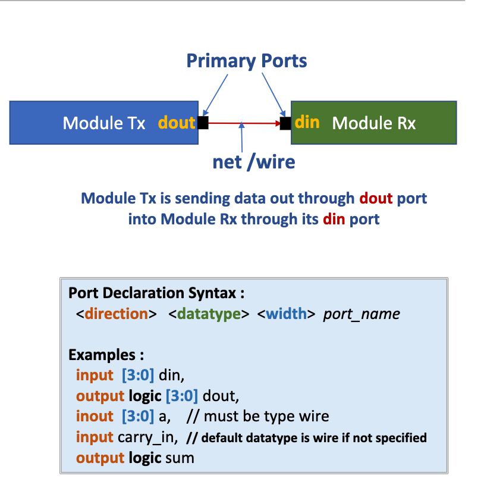

# Lecture 05
# TOC
- [Lecture 05](#lecture-05)
- [TOC](#toc)
- [Main](#main)
  - [Reduction AND](#reduction-and)
  - [SystemVerilog Module Anatomy](#systemverilog-module-anatomy)
  - [Port](#port)
    - [Hierarchical Module and Ports](#hierarchical-module-and-ports)
  - [Port Connections](#port-connections)
  - [Parameters](#parameters)


# Main
## Reduction AND
- instead of A[7]&A[6]&...&A[0], just write &A[7:0] or just &A, if all bits of A are to 
be anded together

## SystemVerilog Module Anatomy
- In SystemVerilog modeling, the primary block 
is called a Module 
    - A module is a container that holds the 
information about a design behavior
    - A module can however contain instances of 
another module(s), to create hierarchy of 
modules
- Module Specification Format 
    - Module start and end declaration
    - Optional parameter list
    - Primary port declarations with directions
    - Local nets and Variables declarations
    - Concurrent statements which defines 
functionality and timing of design
    - Instances of other modules
- Module Name
    - Enclosed between the keywords module and endmodule
    - Name of the module is user defined (for example “counter”)
    - After keyword endmodule it is optional to specify semi-colon module name (for 
example  endmodule: counter)
        - Good coding practice for debugging and documentation purpose especially when there 
might be many lines of code between module and endmodule

- Parameter
    - Optional parameter list specified after module name  
    - Can have any number of parameters declared with default value
    - Enclosed between tokens #( and )
    - Useful to make module configurable
        - Module counter has parameter WIDTH with default value set to 4, which will work as a 4
-bit counter
        - Parameter WIDTH can be overridden during instantiation of this module to some other 
value say, 8 to make it 8-bit counter 

## Port
- What is a Port 
    - A port enables passing of data into and out of a module
    - Ports of modules are connected using a wire (or net)
    - Module can have zero to any number of ports
- Each Port has :
    - name, direction, width
    - data type (built-in and user-defined)
- What is a port direction?
    - Specifies direction of a signal for dataflow to and from 
module 
        - data flows into the module
        - data flows out of the module
        - data flows in and out of the module
        - inout is also known as bi-directional port 



- Port Defaults 
    - Default port direction is “input” if not specified during port declaration
    - Default port data type is “wire” if not specified during port declaration and within 
module definition. 
    - Default port width if not specified is width ‘1’
- Port data type can be either : wire, reg or logic
    - It is not mandatory to specify port data type.
    - Good practice is to specify output port data type as logic 
        ```Verilog
        output logic [3:0] dout;
        ```
- Port data type Rules
    - Input can be of type wire (recommend) or logic
    - Output can be of type reg (deprecated), wire or logic
    - nout is of type wire (recommended) or logic
    - Input and inout ports cannot be declared as reg type in Verilog
- In SystemVerilog modules, all module ports and local variables or nets can be declared as a 
logic type, unless multiply driven. Simulator will correctly infer nets or variables!
    - Best practice is to declare all output ports as logic type when modeling design!
- Port data types can be of user-define data types
    ```Verilog
    typedef logic[3:0] uByte;       
    uByte my_byte;
    ```
### Hierarchical Module and Ports
- A module can contain instances of another module(s), 
to create hierarchy of modules
- Data flows into and out of modules through ports
---
Example
```Verilog
module reduction_and (
  input  [7:0] a,
  output logic y 
 );
  assign y = a[7] & a[6] & a[5] & a[4] & 
 a[3] & a[2] & a[1] & a[0] = &a;
endmodule: reduction_and
```
```Verilog
module reduction_or (
  input  [7:0] a,
  output logic y  
);
  assign y = a[7] | a[6] | a[5] | a[4] |
 a[3] | a[2] | a[1] | a[0] = |a;
endmodule: reduction_or
```
```Verilog
module mux_2to1 (
  input  in0,  in1,  sel,
  output logic  out
 );
  assign out = (sel==1) ? in0 : in1;
endmodule: mux_2to1
```
```Verilog
module toplevel_design (
  input [7:0]  operand1, 
                               operand2,
  input        select,
  output          result
 );
  
  // Declare local nets
  wire c1, c2;
  
  // Instantiate module reduction_and 
  reduction_and inst1(operand1, c1);
  
  // Instantiate module reduction_or
  reduction_or inst2(operand2, c2);
  // Instantiate module mux_2to1
  mux_2to1 inst3(c1, c2, select, result);
endmodule: toplevel_design
```
## Port Connections
- SystemVerilog provides two ways to define the connections to the module 
instance ports
    - Connect by port order (also known as positional port connections)
        - avoid like the plague!  
    - Connect by Port name (also known as named port connections)
        - explicit named connections (suggested approach for port connections)
        - dot-name connections
        - dot-star connections
- Explicit Named Port Connections
    - Module port name is explicitly associated with 
connected signal
    - In explicit name connections, the name of the port is 
preceded by a period and the local signal name is 
enclosed in parenthesis
    - Advantages
        - Named port connections can help prevent accidental 
connection errors
        - Port connections can be listed in any order
        - Unused ports can be left out of the connection list
        - Unused ports can be explicitly listed, but with no local 
signal name in the parenthesis
        - Code is self-documenting. Easy to debug since each port 
and associated signal connection is visually apparent. 
    - Dis-Advantages 
        -Verbosity, for each declaration, both port name and 
connected signal name needs to be specified. This 
can require considerable amount of duplication
    ---
    Example
    ```Verilog
    module reduction_and (
    input  [7:0] a,
    output y  
    );
    assign y = a[7] & a[6] & a[5] & a[4] & 
    a[3] & a[2] & a[1] & a[0];
    endmodule: reduction_and
    ```
    ```Verilog
    module toplevel_design (
    input  [7:0]  operand1, 
    input  [7:0]  operand2,
    input            select,
    output   result
    );
    // declare local nets
    wire c1, c2;
    // module reduction_and instantiated using positional based port connection approach 
    reduction_and inst1(
        .y(c1),  
        .a(operand1)  
    ); 
    endmodule: toplevel_design
    ```
- Positional Port Connections
    - Connects the local net names to the ports of the 
module instances using the order in which the ports in 
the module are defined
    - Order of the ports in the design module should be 
known before correct connection
    - Advantages
        - Simple to code and less code
    - Disadvantages
        - Error-prone : Listing a connection in the wrong order 
can result in design bugs
        - Difficult to debug :  Not easy to review which port of 
the module is driven by specific local net 
        - Difficult to manage :  If the module port list changes, 
all connections in the instantiation of the module 
needs to be reviewed
    ---
    Example
    ```Verilog
    module reduction_and (
    input  [7:0] a,
    output y  
    );
    assign y = a[7] & a[6] & a[5] & a[4] & 
    a[3] & a[2] & a[1] & a[0];
    endmodule: reduction_and
    ```
    ```Verilog
    module toplevel_design (
    input  [7:0]  operand1, 
                                    operand2,
    input            select,
    output   result
    );
    // declare local nets
    wire c1, c2;
    // module reduction_and instantiated using positional based port connection approach 
    reduction_and inst1(operand1, c1); 
    endmodule: toplevel_design
    ```
- Dot-Name Port Connections
    - Only module port name needs to be specified after dot 
operator
    - SystemVerilog infers that a net or variable of same 
name is connected to the port
    - Explicit named port connection can be mixed with dot-
name port connections
    - Advantages
        - Concise representation, easier to read and easier to 
maintain.
    - Rules
        - A net or variable with a name that exactly matches the 
port name must be declared prior to the module 
instance
        - The net or variable vector size must exactly match with 
the port vector size
        - Data types one each side of the port must be 
compatible
    ---
    Example
    ```Verilog
    module reduction_and (
    input  [7:0] a,
    output y  
    );
    assign y = a[7] & a[6] & a[5] & a[4] & 
    a[3] & a[2] & a[1] & a[0];
    endmodule: reduction_and
    ```
    ```Verilog
    module toplevel_design (
    input  [7:0]  operand1, 
                                    operand2,
    input                     select,
    output              result
    );
    // declare local nets
    wire c1, c2;
    // module reduction_and instantiated using mix of dot-name and explicit name based port connection approach 
    reduction_and inst1(
        .y(c1),  
        .operand1  
    ); 
    endmodule: toplevel_design
    ```
- Dot-Star Port Connections
    - Dot-star connection is represented with a special token .*
    - Dot-star is a wildcard that indicated that all ports and signals 
of the same name should automatically be connected for 
that module instance.
    - Explicit named port connection can be mixed with dot-star 
port connections
    - Dis-Advantages
        - Code maintenance and debugging more difficult since 
port and its associated signal mapping is not mentioned
    - Advantages
        - Least amount of code and most concise form of port 
connection
        - Does not allow a port to be inadvertently left unconnected
        - Does not infer unconnected port
    - Rules
        - For dot-star connection to work it is required that signals 
have same name as port names
        - The net or variable vector size must exactly match with the 
port vector size
    ---
    Example
    ```Verilog
    module reduction_and (
    input  [7:0] a,
    output y  
    );
    assign y = a[7] & a[6] & a[5] & a[4] & 
    a[3] & a[2] & a[1] & a[0];
    endmodule: reduction_and
    ```
    ```Verilog
    module toplevel_design (
    input wire[7:0]  operand1, 
    input wire[7:0]  operand2,
    input wire           select,
    output wire  result
    );
    // declare local net ‘y’ with same width as port ‘y’ in reduction_and
    wire y;
    // module reduction_and instantiated using mix of dot-star based port connection approach 
    reduction_and inst1(
        .*
    ); 
    endmodule: toplevel_design
    ```


## Parameters
- Parameters
    - Modules can be modeled using parameter construct
    - Modules which contain parameter constants are referred as “parameterized modules”
    - Parameter constants can be used to define port signal width, local variables width and net width
    - Parameters are compile time constants (i.e. value can be configured during compilation or elaboration 
time and once simulation starts running or synthesis start, it has a fixed value)
    - There can be multiple parameters defined in module
    - See example below where module half adder has a parameter N with default value set to ‘1’,  and this 
half_adder module is instantiated in module top with N overridden to value ‘4’ to make it 4-bit wide 
adder
        ```Verilog
        module half_adder
        #(parameter N=1) // Parameter 
        declaration
        (
        input [N-1:0] a, b, 
        output logic [N-1:0] sum
        );
        assign sum = a + b;
        endmodule
        ```
        ```Verilog
        module top
        (
        input [3:0] in1, in2, 
        output logic [3:0] sum
        );
        half_adder #(.N(4)) ha_instance(
            .a(in1), 
            .b(in2), 
            .sum(sum), 
        );
        endmodule
        ```
- There are two types of parameter constants
    - Parameter : run-time constant that can be externally modified
    - Localparam : run-time constant that can be set internally
    - Parameters can be defined with module and in a local scope 
    - Syntax
        ```Verilog
        parameter  data_type  signedness  size name = value_expression;
        localparam  data_type  signedness  size name = value_expression;
        ```
    - Example
        ```Verilog
        module example1
        #(parameter N=1) // Parameter declaration
        (
        input [N-1:0] opnd1, opnd2,
        input [1:0] operation,
        output logic[N-1:0] out
        );
        // Parameter defined in a local scope of a module
        parameter SIZE = 32;
        ......
        ......
        endmodule: example1
        ```
        ```Verilog
        module example2
        parameter N = 8, // N defaults to logic signed [31:0]
                            integer Y = 4, // Integer data type parameter
                            PI = 3.14, // defaults to real data type
                            string NAME = “usb”; // explicit string type
        localparam P = $clog2(N);  // explicit type
        localparam [1:0] STATE_IDLE = 2’b00, // 4 constants of logic type
                        STATE_REQ = 2’b01,
                                        STATE_ACK = 2’b10,
                                        STATE_GNT = 2’b11;  
        // $clog2(N) = ceiling(log2(N))
        ......
        ......
        endmodule: example2
        ```
- Parameters can be overridden using defparam during module instantiation time
    - Using defparam, order of parameter when overriding is not required to be maintained
    - Example
        ```Verilog
        module half_adder
        // Multiple Parameter declaration
        #(parameter N=1,
        )
        (
        input [N-1:0] a, b, 
        output logic [N-1:0] sum
        );
        parameter W=1;
        assign sum = a + b;
        endmodule: half_adder
        ```
        ```Verilog
        module top (
        input [3:0] in1, in2, 
        output logic [3:0] sum
        );
        // parameter W overridden using defparam
        // defparam can be declared before  module instantiation
        defparam ha_instance.W = 4;
        half_adder ha_instance(
            .a(in1), 
            .b(in2), 
            .c(sum), 
        );
        // defparam can also be declared after module instantiation
        defparam ha_instance.N = 4;
        endmodule: top
        ```

    