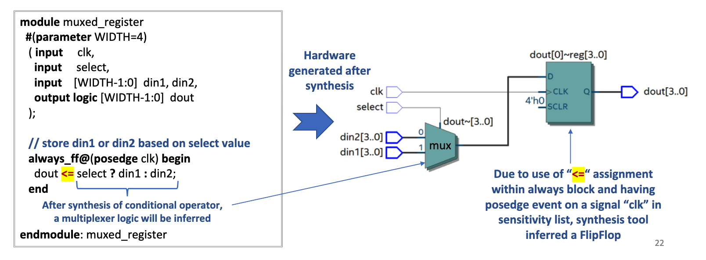

# Lecture 06
# TOC
- [Lecture 06](#lecture-06)
- [TOC](#toc)
- [Main](#main)
  - [Conditional Operator](#conditional-operator)
  - [Continuous Assignment](#continuous-assignment)
  - [Type logic signed or wire signed](#type-logic-signed-or-wire-signed)
  - [SystemVerilog Data Value Set](#systemverilog-data-value-set)
  - [SystemVerilog Data Types](#systemverilog-data-types)
    - [Net](#net)
    - [Variable](#variable)
    - [Summary on Wire, Reg and Logic Data Types](#summary-on-wire-reg-and-logic-data-types)
    - [SystemVerilog and Verilog Data Types](#systemverilog-and-verilog-data-types)
    - [Use of 2-State Variables with Caution !](#use-of-2-state-variables-with-caution-)
    - [Nets and Variables Inference](#nets-and-variables-inference)
    - [Integer](#integer)
    - [Time](#time)
    - [Real](#real)
****
# Main

## Conditional Operator
- Widely used operator in RTL modeling. Also known as Ternary operator !!
- Similar to if-else statement, comes from C 
- Conditional operator often behaves like a hardware multiplexer
- Can be used in continuous assign statement and also within always procedural blocks
    |conditional operator|Syntax|Example Usage|
    | --- | --- |---|
    |? :|conditional expression ? true expression : false expression | assign out= p ? a : b |
    
    If “p” is true then assign value of “a” to “out” otherwise assign value of “b” to “out”
- Conditional expression listed before “?” is evaluated first as true or false
    - If evaluation result is true, then true expression is evaluated
    - If evaluation result is false, then false expression is evaluated
    - If evaluation result is unknown “x”, then conditional operator performs bit by bit comparison of 
the two possible return values
        - If corresponding bits are both 0, a 0 is returned for that bit position
        - If corresponding bits are both 1, a 1 is returned for that bit position
        - If corresponding bits differ or if either has “x” or “z” value, an “x” is return for that bit position 
- Example
    ```Verilog
    logic sel, mode;
    logic [3:0] a, b, mux_out;
    assign mux_out = (sel & mode) ? a : b;
    ```
    
- Example : Conditional operator mapped to a multiplexor and a registered output
    - Conditional operator to choose between two inputs for input to a register
    - Conditional operator inside always block
    - Synthesis compiler will map conditional operator to four multiplexers, one for each bit of 
din1 and din2 input and there will be 1 flipflop for each bit
    
- Example : Conditional operator mapped to tri-state buffer
    - Synthesis compiler will not always map conditional operator to a multiplexor
    - Conditional operator can also be mapped to tri-state buffer based on how 
conditional operator is used and its operand data type and its values.
    -  assign target = condition ? expression : 1'bz;
    
- Example : Conditional operator mapped to a mux
    - Changing false expression value from 4’bz to 4’b0 synthesis compiler infers 
multiplexor instead of tri-state buffer
    

## Continuous Assignment
- Continuous assignment statement drives a right-hand side (RHS) expression onto a net or a variable 
in left-hand side (LHS)
    - Continuous assignment statements RHS expression evaluation starts from simulation time 0 and 
continues until end of the simulation !
    ---
    ```Verilog
    //Syntax : 
    assign #(delay) net or a variable = expression;
    //Example :
    wire a, b, c, d;
    assign c = a + b; // assignment to ‘d’ happens immediately at current simulation time
    assign #2 d = a - b;  // assignment to ‘d’ is delayed by two-time units
    ```
- It is called continuous assignment because in example above, wire “c” is continuously updated 
whenever a or b changes.  Any change in a or b will result in change in c.
- This can be used for modeling combinational logic
- The assignment may be delayed by the specified amount 
    - Synthesis compiler ignores the delay if specified, since it expects zero-delay RTL models
    -  If no delay is specified, the assignment happens at the current simulation time
- Verilog required LHS of an assign to be a net and not a variable. SystemVerilog allows both in LHS ! 
- Module can contain any number of continuous assign statements and each assign 
statement runs concurrently. 
    - These multiple assign statements are not executed in any specific order with respect to each 
other
    - Changing order of multiple continuous statement within module has not implication in 
synthesis results
    - Example : Half adder with multiple continuous assignment statements
    
- There are two types of continuous assignment statement :
    - Explicit continuous assignments
        - Example : assign sum = a + b; // assign keyword is explicitly specified
        - Supports both net and variable on LHS
    - Implicit net declaration continuous assignments
        - Example :  wire[2:0] sum = a + b; // continuous nature is inferred even though assign is not explicitly specified
        - Implicit continuous assignments can only have nets on LHS
- Continuous assignment statement cannot be used in initial block and always procedural block
    - initial block runs only once during simulation, it exits once “end” statement is hit whereas always block can runs 
continuously (or multiple times)
- Continuous assignment however it can be inferred if used in always procedural block.
 
- Synthesis compiler will give error when same variable is driven in both always@ procedural 
block and driven by continuous assignment statement.
- Synthesis compiler will give error when same variable is driven from multiple continuous 
assignment statements
-  LHS of continuous assignment statement can be :
    - Scalar, 1-bit, net or a variable or a user defined data type
    - Vector net or a variable
        - If LHS is a smaller vector size than RHS, then MSB’s of the vector on RHS will be truncated to the 
size of vector on LHS.
        - If LHS is a larger vector size than RHS, then RHS vector will be extend with zeros in its MSBs. 
    ```Verilog
    //Example :
    wire[4:0] A, B; // packed array
    wire[5:0] C, D; // packed array
    wire E [4:0]; // unpacked array  
    // LHS is smaller width than RHS
    assign A = C;  // MSB of wire C[4] will be truncated  
    // LHS is larger width to larger width
    assign D = B; // ‘0’ will get assigned to MSB of wire D[4]
    assign E[0] = A[0]; // LHS cannot have unpacked array 
    ```
- LHS of continuous assignment statement cannot be an unpacked structure or unpacked array
- RHS of continuous assignment statement can be an expression comprising of :
    - Nets, Variables (registers), Function call, Concatenation operations, Bit or Part selects
- RHS of continuous assignment statement can have function call
    ```Verilog
    module ex_add(
    input [1:0] a, b, c,
    output logic[1:0] q
    );
    // Function add3
    function logic[1:0] add3(input [1:0] x, y, z) 
    add3 = x + y + z;
    endfunction
    // Function add3 called on RHS of assign statement
    assign q = add3(a, b, c);
    endmodule: ex_add
    ```
- If RHS expression has an array reference with 
variable index then synthesis compiler will  
generate a mux.
-  If RHS expression has an array reference with a 
constant index then synthesis compiler will 
generate just a wire and not a mux.
    

## Type logic signed or wire signed
- Two's comp.
- sign extension rules apply instead of zero fills
- input signed[3:0] a, logic signed[4:0] b;
- ... b=a; // b = {a[3],a[3:0]};   // or just {a[3],a}
- input [3:0] a, logic [4:0] b;
-   ... b=a; // b = {1'b0,a};

## SystemVerilog Data Value Set
- For RTL modeling, SystemVerilog uses a four-value set to represent actual value that can 
occur in silicon
- These 4-Value Sets are described in the table below :
    | Value | Abstract State |
    | --- | --- |
    | 0 | Represents an abstract digital low state |
    |1 | Represents an abstract digital high state | 
    | Z | Represents abstract digital high-impedance state. <br>In multi-driver circuit, a value of 0 or 1 will override a Z|
    | X | Represents either uninitialized value, or uncertain value or a conflict of values in a multi-driver circuit|
- Note
    - Values of ‘0’, ‘1’, and ‘Z’ are an abstraction of values that can exist in actual silicon
    - The value of ‘X’ is not an actual silicon value. 
    - Simulators use ‘X’ value to indicate uncertainty in how physical silicon would behave 
under specific conditions (contention or not initialized). 

## SystemVerilog Data Types
- SystemVerilog data can be specified using two 
properties :
    - Data kind and data type. 
    - Data kind refers to usage as net type or variable type. 
    - Data type refers to possible values a data kind can take. 
- Any data can be declared using the syntax:
    ```Verilog
    //<data_kind> <data_type> <literal_name>
    //example
    var logic carry_out; 
    wire [2:0] sum;
    ```
     - carry_out is declared as a variable which can store 4-
state values
    - var specification before data type is optional (logic carry_out;)
    - sum is declared as a net which can store 4-state values

- SystemVerilog data types are divided into two main groups: 
    - Nets and Variables
    - Distinction comes from how they are intended to represent different hardware elements
- Nets and Variables both have a data type
    - Data Type indicates value system of the net or the variable, 
        - A net or variable is either 2-state (0,1) or 4-state (0,1,X,Z)
        - Example : wire is a 4-state net, logic is a 4-state variable; bit/byte/int is a 2-state variable
- Data types are used by simulators and synthesis compilers to determine how to store and 
process changes on that data
    - Store as 4-state or 2-state value
- Data types are used in RTL modeling to indicate desired silicon behavior, such as 
    - Example, ALU should be integer based or floating-point based 

### Net
- Net represents a physical connection between structural entities, such as between 
gates or between modules. 
    - Think like a plain wire connecting two elements in a circuit.  

- Net does not store value
- Net is continuously driven. 
    - Its value is derived from what is being driven from its driver(s)
- wire is probably the most common type of a Net
    - some other net data kinds are tri, wand, wor, supply0, supply1, triand, trior. 
- Rules for Wire Data Kind
    - wire elements are used as inputs and outputs within an actual module declaration. 
    - wire elements must be driven by something, and cannot store a value without being driven. 
    - wire elements cannot be used as the left-hand side of an “=“ or “<=“ statement within an 
always or initial block. 
    - wire and logic elements are the only legal type on the left-hand side of an assign statement. 
    - wire elements can only be used to model combinational logic!
    ---
    ```Verilog
    module example_wire_reg
    ( input     A, B, C,  // 1-bit input wire
        output  logic d,   // 1-bit reg variable
        output result);
    
    always_comb
        d = B | C;  // LHS has to be logic. “d” cannot be a wire ! grammar rule :(
    
    assign result = A & B;  // LHS of assign may be either wire or logic. “result” can be either a wire or logic data kind ! 
    endmodule: example_wire_reg
    ``` 

### Variable
- Represents data storage elements in a circuit
    - Provides temporary storage for simulation, does not mean actual storage in silicon
    - It holds last value assigned to it until the next assignment
- logic is probably the most common variable data type
    - logic is generally used to model hardware registers
        - Although it can also represent combinatorial logic, like inside an always_comb block). 
    - logic default value is ‘X’
    - Must be used when modeling sequential elements such as shift registers, etc !

- Synthesizable variables in SystemVerilog are :   
    - logic, reg (deprecated), bit, byte, integer, shortint, int, longint -- Can be used in design code  and in testbench code !
- Non-synthesizable variables in SystemVerilog are :
    - real, shortreal, time, realtime  -- Can be used in testbench code, but not in design !
- Rules for Reg Data Type -- my rule: don't use it
    - reg elements can be used as outputs within an actual module declaration. 
    - reg elements cannot be used as inputs within an actual module declaration. 
    - reg and logic is the only legal type on the left-hand side of “=“ or “<=“  statement with an 
always block
    - reg cannot be used on the left-hand side of an continuous assign statement. 
    - reg can be used to create registers when used in conjunction with always@(posedge clock) 
blocks. Therefore, reg be used to create both combinational and sequential logic !
    ---
    ```Verilog
    module example_wire_reg
    ( input A, B, clock, d,  // 1-bit input wire
        output  logic q,   // 1 bit reg variable
        output  logic result);
    
    always_ff@(posedge clock) begin
        q <= d;  // LHS has to be either reg or logic. “q” can be either reg or logic and it cannot be a wire data kind !
    end
    
    assign result = A & B;  // LHS of assign should be either wire or logic. “result” cannot be a reg data kind in Verilog !
    endmodule: example_wire_reg
    ```
- Replace wire and reg data types with logic in SystemVerilog!
    - In SystemVerilog design modeling use logic everywhere in place of a wire and a reg 
        - Pass the burden to language compiler/simulator to infer correct data type internally !
    - logic elements can be used as inputs, outputs, inouts within an actual module declaration. 
    -  logic can be used on left-hand side of “=“ or “<=“  statement with an always block
    - logic can be used on the left-hand side of a continuous assign statement. 
    - logic can be used to model both combinational and sequential hardware logic elements 
    ---
    ```Verilog
    module example_logic
    ( input   A, B, clock, d,  // language will automatically infer these inputs as a wire ! 
        output  logic q, // language will automatically infer output “q” as a reg !
        output logic result // language will automatically infer output “result” as a wire !
    );
    always_ff@(posedge clock) begin
        q <= d;  // language will automatically infer logic “q” as a reg !
    end
    
    assign result = A & B;  // language will automatically infer output logic “q” as a wire !
    endmodule: example_logic
    ```
### Summary on Wire, Reg and Logic Data Types
- wire
    - wire is used for 
connecting different 
modules and other logic 
elements within module 
    - It can not store 4-state 
values.
     - It can be driven and read. 
     - wire data type is used on 
left hand side (LHS) in 
the continuous 
assignments and can be 
used for all types of ports. 
- reg (deprecated)
    - reg is a date storage 
element. Just declaring 
variable as a reg, does not 
create an actual register 
but it can store values
    - reg variables retains value 
until next assignment 
statement.
    - reg data type variable is 
used on left hand side 
(LHS) of blocking/non-
blocking assignment 
statement inside in am 
always blocks and in 
output port types
- logic
    - logic is an extension of reg
data type. It can be driven 
by both continuous 
assignment or 
blocking/non blocking 
assignment (= and <=).
    - logic can also be used in 
all type of port 
declarations (input, 
    output and inout)
    - logic was introduced in 
SystemVerilog; not 
supported in older 
Verilog!

### SystemVerilog and Verilog Data Types
 


### Use of 2-State Variables with Caution !
- Avoid all 2-state data types in RTL modeling, but fine for test bench
    -  2-state data types can hide design bugs !
    -  It can lead to simulation vs synthesis mismatches
        - Synthesis treats bit, byte, shortint, int and longint 2-state data types as a 4-state 
reg variable. Simulation treats as 2-State variable. 
        - Simulation might start with a value 0 in each bit whereas synthesized 
implementation might power-up with each bit a 0 or 1.
        - Any x or z driven values on 2-state variables, are converted to 0. These data types 
are initialized to 0 at the start of simulation and may not trigger an event for 
active low signals.
    - Exception : use 2-state int data type variable for the iterator variable in for-loops 
where X and Z is not required.
 ### Nets and Variables Inference
 - General Inference rules in SystemVerilog for nets and variables :
    - bit is 2-state variable, as is byte
    - wire is a 4-state net
    - reg is a 4-state variable // deprecated
    - logic is a 4-state net and/or variable
    - logic infers a net if used in input or inout port declaration
    - logic infers a variable if used in output port declaration
    - logic infers a variable if used to declare internal signals within module and does not have wire 
specified before logic
    - reg cannot be used in input and inout port declaration. It can be used in output port 
declaration.  // better still -- just avoid using it entirely
    - default port datatype is wire if not declared explicitly when declaring ports
    - default datatype of signals declared within module is a logic type variable if not explicitly 
defined
    - var keyword before logic, bit and reg data type for internal signal declaration is optional since 
by default these three are variables.
    - For nets declared as wire for internal signals within module, it is treated as a logic type net 
even though it is not explicitly specified.
    ---
    ```Verilog
    module top( 
    
    // module ports with inferred types
    input in1,  // infers a 4-state net. Infers wire type net since net type is not explicitly declared
    input logic in2,  // infers a 4-state net. The logic infers a net if used in input or inout type port declaration
    input bit in3,  // infers a 2-state variable. The bit always infers a variable
    output out1,  // infers a 4-state net. Infers wire type net since net type is not explicitly declared
    output logic out2,  // infers a 4-state variable. The logic infers a variable if used in output type port declaration
    output bit out3  // infers a 2-state variable. The bit always infers a variable
    output reg out4  // infers a 4-state variable. The reg always infers a variable and it can only be used for output port types
    ); 
    // internal signals with inferred and explicit types
    bit fault;  // infers a 2-state variable. The bit always infers a variable.
    logic d1;  // infers a 4-state variable. The logic infers a variable if used in signal declaration if not qualified with 
    wire
    logic [3:0] d2;  // infers a 4-state variable.
    reg [7:0] d2;  // explicitly declares a 4-state variable.  // avoid
    wire [2:0] w1;  // explicitly declares a net, infers 4-state logic
    wire logic [2:0] w2;  // explicitly declares a 4-state net  // just wire[2:0]
    var [3:0] d3;  // explicitly declares a variable, infers logic. // so just use logic
    var logic [3:0] d4;  // explicitly declares a 4-state variable. var specification is optional.
    endmodule: top  

    ```
### Integer
- Integer is a general purpose 4-state variable of logic data type
    - For synthesis it is used mainly for loops-indices, parameters, and constants. 
    - They are of implicitly of type logic
- Declared with keyword integer
- Integer store data as signed numbers whereas explicitly declared logic types store them as unsigned
    - Negative numbers are stored as 2’s complement
- Size of integer is implementation specific (at least 32 bits)
    - If they hold numbers which are not defined at compile time, their size will default to 32-bits
- If they hold constants, the synthesizer adjusts them to the minimum width needed at compilation.
- Example:
    ```Verilog
    integer data;  //32-bit integer  same as logic signed[31:0] data;
    assign b = 31; //synthesizer will treat b as a 5-bit integer
    ```
### Time
- time is a special 64-bit data type that can be used in conjunction with the $time system task to hold simulation time. 
- Declared with keyword time
- time is not supported for synthesis and hence is used only for simulation purposes
- Syntax :       time variable_name;
- Example
    ```Verilog
    time start_t;
    initial 
    start_t = $time();
    ```
### Real
- SystemVerilog supports real data type constants and variables
    - Declared with keyword real
    - Real numbers are rounded off to the nearest integer when assigning to an integer.
    - Real Numbers can not contain 'Z' and ‘X’
    - Not supported for synthesis. // keep track of your own binary point
- Real numbers may be specified in either decimal or scientific notation
    - < value >.< value >  :  e.g 125.6 which is equivalent to decimal 125.6
    - < mantissa >E< exponent > :  2.5e4 which is equivalent to decimal 25000
- Syntax :
       real variable_name;
- Example :
    ```Verilog
    real height;
    height = 50.6;
    height = 2.4e6;
    ```