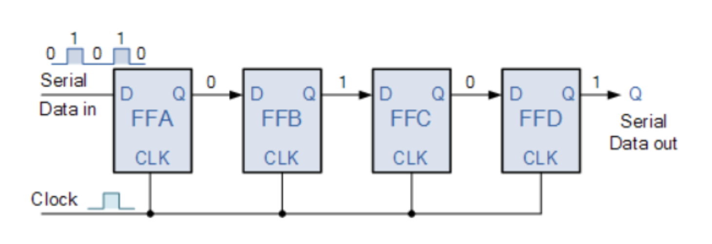
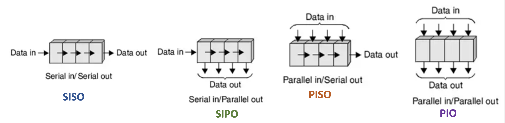
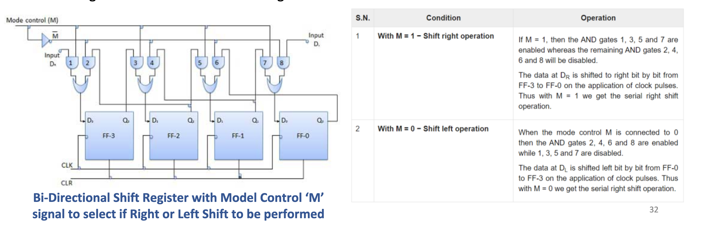

# Lecture 07
# TOC
- [Lecture 07](#lecture-07)
- [TOC](#toc)
- [Main](#main)
  - [Posedge and negedge event](#posedge-and-negedge-event)
  - [Always Block](#always-block)
  - [Procedural Assignments](#procedural-assignments)
    - [Blocking Assignment](#blocking-assignment)
    - [Non-Blocking Assignment](#non-blocking-assignment)
    - [Blocking vs Non-Blocking Assignment](#blocking-vs-non-blocking-assignment)
    - [SV Scheduling Flow](#sv-scheduling-flow)
    - [Swapping variables](#swapping-variables)
    - [Rules](#rules)
  - [Procedural Assignments with Delays](#procedural-assignments-with-delays)
    - [Inter-Delay](#inter-delay)
    - [Intra-delay](#intra-delay)
  - [Shift Register](#shift-register)
  - [Ring Counter](#ring-counter)
  - [Barrel Shifter](#barrel-shifter)

# Main
## Posedge and negedge event
- posedge
  - Positive edge (posedge) defines a rising edge of a signal
  - Posedge event triggers when a signal transitions from: 
    - 0 to 1
    - 0 to X
    - X to 1 
    - 0 to Z 
    - Z to 1
- negedge
  - Negative edge (negedge) defines a falling edge of a signal
  - Negedge event triggers when a signal transitions from: 
    - 1 to 0
    - 1 to X
    - X to 0 
    - 1 to Z 
    - Z to 0

## Always Block 
```verilog
always@(<sensitivity list>) begin
   <procedural statements>
end

always@(a or b) begin
  c = a ^ b; // executes if value of ‘a’ or ‘b’ changes
end
```
- `always` procedural blocks are used to describe events that should happen under certain 
conditions.
    - whenever any event in the sensitivity list occurs, the procedural statements are 
executed
    - sensitivity list can have one or more signals specified
    - always block runs continuously throughout the simulation !
- Event in sensitivity list can be specified in multiple different ways :
  - Edge (posedge, negedge)
    - `always_ff@(posedge clock) `
    - `always_ff@(negedge clock) `
  - Level (any change in value of signal)
    - `always@(interrupt) `
    - `always_comb`
  ```verilog
  // always block sensitive to 
  // posedge event of clock
  always_ff@(posedge clock) begin
    dout <= din;
  end

  // always block sensitive to
  // negedge event of clock
  always_ff@(negedge clock) begin
    dout <= din;
  end

  // always block is sensitive to both 
  posedge and negedge event of interrupt
  always@(interrupt) begin
    abort = 1;
  end
  ```
- Overview of Always Block 
  - Always procedure can be used to model :
  - Combinational logic
  - Clocked sequential logic (such as flipflops)
  - Level sensitive logic (such as latches)
- Sequential Logic is triggered by a ‘CLOCK’ event
  - Latches are sensitive to level of the signal
  - Flip-flops are sensitive to the transitioning of clock
    - Synthesis compiler will infer a flip-flop if sensitivity list has posedge or negedge event
- Sequential Logic using Posedge CLOCK Event
  ```verilog
  module flop (
    input clk, d,
    output logic q);
   
   always_ff@(posedge clk) 
  q <= d; 
  endmodule
  //Always block triggers upon rising edge of clk.
  //posedge CLOCK event and “<=“  will infer storage  and sequential logic
  ```
- Combinational Logic 
  ```verilog
  module comb (
    input logic inv, input logic [3:0] data,
    output logic [3:0] result);
    
    always_comb 
      if(inv) result = ~data; 
      else    result = data;
   
  endmodule

  //Always block triggers if either inv or data value changes. 
  //No storage created. Purely combinational logic inferred
  ```
## Procedural Assignments
- SystemVerilog has two types of procedural assignments to model 
combinational and sequential circuits/logic
    - Blocking Assignments represented with equal sign (=) to model combinational logic
    - Non-Blocking Assignments represented with less-than-equal (<=) to model 
sequential logic, such as flip flops, latches, shift registers, etc

### Blocking Assignment
- Syntax
    - `LHS Variable_Name = [delay or event control] RHS_Expression;`
- Example
  ```
  integer a, b, c, sum, prod;
  initial begin
    a=5; b=10; c=4; sum=2; prod=8;
    sum = a + b;
    prod = sum * c;
  end
  ```
  Statements with Blocking assignment will 
execute one at a time in the order it is specified.  Hence `sum = a + b` line will block execution of 
line `prod = sum *c `until `a + b` addition is 
computed and new value of addition is assigned 
to variable sum.

  Simulation Result
  - Initial values of a=5, b=10, c=4, sum=2, prod=8
  - sum becomes (5 + 10) = 15
  - prod becomes (15 * 4) = 60
- Evaluation and assignment in a single step
  - Expression on RHS of (=) assignment is evaluated and the variable on LHS is updated 
immediately before the next sequential statement in the procedural block is evaluated and 
executed. 
- Execution flow within the procedure is blocked until the current assignment is completed
  - Hence blocking assignment statement is used to model combinational logic.
- Each blocking assignment statement executes sequentially in the order it is specified in a 
procedural block
### Non-Blocking Assignment
- Syntax
  - `LHS Variable_Name <= [delay or event control] RHS_Expression;`
- Example
  ```
  integer a, b, c, sum, prod;
  initial begin
    sum <= a + b;
    prod <= sum * c;
  end
  ```

  Both statements with non-
blocking assignment will 
execute concurrently without 
blocking each other

    Simulation Result
    - At time 0 ns, Initial values a=5, b=10, c=4, 
    -  At time 1 ns, 
       -  sum becomes (5 + 10) = 15
       -  prod becomes (2 * 4) = 8

- Evaluation and assignment is a two-step process
  - Expression on RHS of (<=) assignment is evaluated immediately 
  - Assignment to LHS variable is postponed until other evaluations in current time step is 
completed
  - Latest RHS value is assigned to target LHS variable at the end of the simulation cycle
- Each non-blocking assignment statement within the procedural block executes in parallel 
(concurrently) without blocking each other
    - Hence the order of specifying non-blocking assignment statement does not matter !
- Clock-to-Q propagation delay of flip-flop behavior is represented by non-blocking 
assignments in RTL model even though RTL code is modeled with zero-delays. 
    - Hence non-blocking must be used to model sequential logic

### Blocking vs Non-Blocking Assignment
- Blocking Assignment
  - Value is assigned immediately. 
  - Process waits until the first assignment 
is complete, it blocks progress
- Non-Blocking Assignment
  - Values are assigned at the end of the 
block.
  - All assignments are made in parallel, 
process flow is not-blocked.

### SV Scheduling Flow
1. Active Events Region: Intermixed and executes below mentioned in any order
   - Execute programming statements and operators
     - All continuous assignments
       - Evaluate right-hand side and update left-hand side
       ```verilog
       assign a = b;
       assign y = p ? q : r;
       ```
     - All Blocking assignments
       - Evaluate right-hand side and update left-hand side
       ```verilog
       always_comb
       begin
        sum = m + n;
        prod = m * n;
       end
       ```
      - All non-blocking assignments
        - Step1 : Evaluate right-hand side
         ```verilog
         always_ff@(posedge clk)
         begin  
           r1 <= d;
           q <= r1;
         end
         ```
   - Evaluate and print output from `$display`, `$write` and `$finish`
   - Evaluate inputs and update outputs of primitives
2. Inactive Events Region
    - All #0 Blocking Assignments
3. NBA Update Events Region: Intermixed and executes below mentioned in any order
    - All Non-Blocking Assignments
      - Step2 : Update left-hand side
4. Postponed Reigion
    - `$monitor` is not executed 
until “postponed” event 
region

### Swapping variables 
- BA
  ```verilog
  always@ (posedge clock)
     p = q;
  always@ (posedge clock)
     q = p;
  ```
  - Both always blocks will execute concurrently 
and there is a race condition between two 
always  procedural assignments
   - Assume Initial Value of p=5 and q=8
     - If simulator executes always block with p = 
q first, before q = p, then both p and q will 
get value of q (Final values : p=8 and q=8)
      - If simulator executes always block with q = 
p first, before p = q, then both p and q will 
get value of p (Final values : p=5 and q=5)
    - No Swapping of values of p and q !!
  ```verilog
  always@(posedge clock) begin
    tmp1 = p;   // what happens with <=
    tmp2 = q;
    p = tmp2;
    q = tmp1;   
  end
  ```
  - Swapping of values of p and q happens !!
  - To swap values of p and q using blocking 
assignment requires temporary variables as 
shown above
  - Assume Initial value of p=5 and q=8
    - tmp1 will get assigned 5
    - Tmp2 will get assigned 8
    - p will get assigned value of tmp2, which 
is 8, same as value of q
    - q will get assigned value of tmp1, which 
is 5, same as previous value of p
- NBA
  ```
  always_ff@ (posedge clock)
     p <= q;
  always_ff@ (posedge clock)
     q <= p;
  ```
    - Both always blocks will execute 
concurrently, however there is no race 
condition and actual swapping of values of p 
and q happens !!
    - RHS variables are read first and assigned to 
LHS at the end of the simulation cycle and 
new RHS variable is available at the next 
posedge of the clock
    - Assume Initial Value of p=5 and q=8
      - p gets previous value of q, hence p=8
      - q get previous value of p, hence q=5

### Rules
- It is not recommended (even not allowed in a design) to have both blocking and non-
blocking assignment statements in same always block. 
- Synthesis compiler will ignore inter and intra delays in both blocking and non-blocking 
procedural assignment statement
    - If delays are used, then expect mis-match between RTL and synthesized netlist simulation result
- Same variable cannot have both blocking and non-blocking assignments to it. Below 
mentioned is not allowed !!

## Procedural Assignments with Delays
### Inter-Delay
Inter-delay refers to the delay between two events that occur in different parts of a circuit. 

This type of delay can occur between different modules or between different parts of a module. Inter-delay can be affected by many factors, including the number of gates, the type of gates, the routing of signals, and the power supply.

### Intra-delay
 Intra-delay refers to the delay between two events that occur in the same part of a circuit. 
 
 This type of delay can occur within a single gate or within a small portion of a module. Intra-delay can be affected by factors such as the type of gate, the manufacturing process, and the power supply.

 ## Shift Register
 - What is a Shift Register
   - A register capable of shifting its binary information either from right to left or left to right is called 
a shift register.
    - As shift register typically consists of several single bit “D-Type Flip-Flop”, connected together in a 
serial type daisy-chain arrangement so that the output from one Flip-Flop becomes the input of 
the next Flip-Flop and so on
    - Shift Register typically is used for data storage or for movement of data and are therefore 
commonly used inside calculators or computers :
        - To store data such as two binary numbers before they are added together, or 
        - To convert the data from either a serial to parallel or parallel to serial format
    
- Types of Shift Register
  - Serial In / Serial Out (SISO) : One bit of data can be moved in and out of the register serially at a time
  - Serial In / Parallel Out (SIPO) : One bit of can be loaded serially but the stored data can be taken out 
of the register parallelly
  - Parallel In / Serial Out (PISO) : The data can be loaded simultaneously but can be removed only as 
one bit at a time for each clock pulse
  - Parallel In / Parallel Out (PIO) : The data can be loaded and read out into the register 
simultanesoulsy
    

- Bi-Directional Shift Register
  - If a binary number is shifted left by one position then it is equivalent to multiplying the original number 
by 2.  Example :  0001 (decimal value 1) Left Shift by 1  = 0010 (decimal value 2)
  - Similarly, if a binary number is shifted right by one position then it is equivalent to dividing the original 
number by 2. Example :  1000 (decimal value 8) Right Shift by 1  = 0100 (decimal value 4)
  - To use a N-bit shift register to multiply and divide the given binary number, then it is required to move 
the data in either left or right direction.
  - Such a register is called bi-directional register 
    

## Ring Counter
- What is a Ring Counter
  - Ring counter is an application of a Shift Register.
  - A N-bit ring counter is composed of N-bit shift register, with the output of the last flip-flop fed 
to the input of the first flip-flop, making a "circular" or "ring" structure. 
    
  - There are two types of ring counters:
    - Straight ring counter : Also known as a one-hot counter (only 1-bit changes at a time in a 
count value), connects the output of the last shift register to the first shift register input 
and circulates a single one (or zero) bit around the ring. 
        - N-bit straight ring counter has N-states and N number of flipflops
    - wisted ring counter : Also known as a walking ring counter or a Johnson counter, in which 
the complement of the output of the last shift register to the input of the first register and 
circulates a stream of ones followed by zeros around the ring. 
        - N-bit johnson counter has 2N-states and N number of flipflops

## Barrel Shifter
- Performs shift or rotate operations by specified number of bits in same clock cycle
  - Purely combinational circuit and result of operation is available within same clock cycle
  - Similar to bidirectional shift register however, the shift register shifts one place in one cycle whereas 
barrel shifter can shift many places in same cycle and the shift register is a sequential logic
- Barrel shifters can perform below mentioned operations :
  - Logical Shift Right (LSR), Logical Shift Left (LSL), Rotate Left (ROL) and Rotate Right (ROR)
- Shift and Rotate can move input data bits by any number of bit positions
  - 4-bit barrel left shift can shift by 0, 1, 2 or 3 bit positions
  - 8-bit barrel left shift can shift by 0, 1, 2, 3, 5, 6, 7 bit positions
- Typically designed as a natural size (2, 4, 8, 16, 32 ...) barrel shifters
