# 来美机票购票指南

*建议使用电脑进行操作*
- [来美机票购票指南](#来美机票购票指南)
  - [1. 登陆官网](#1-登陆官网)
  - [2.搜索机票](#2搜索机票)
  - [3.选择机票](#3选择机票)
  - [4.完成乘客信息](#4完成乘客信息)
  - [5.付款](#5付款)

## 1. 登陆官网
第一步为登陆官网并登入账号
- 进入国泰航空官网https://www.cathaypacific.com/cx/sc_CN.html](https://www.cathaypacific.com/cx/sc_CN.html)
- 点进右上角登陆按钮进入登陆界面
  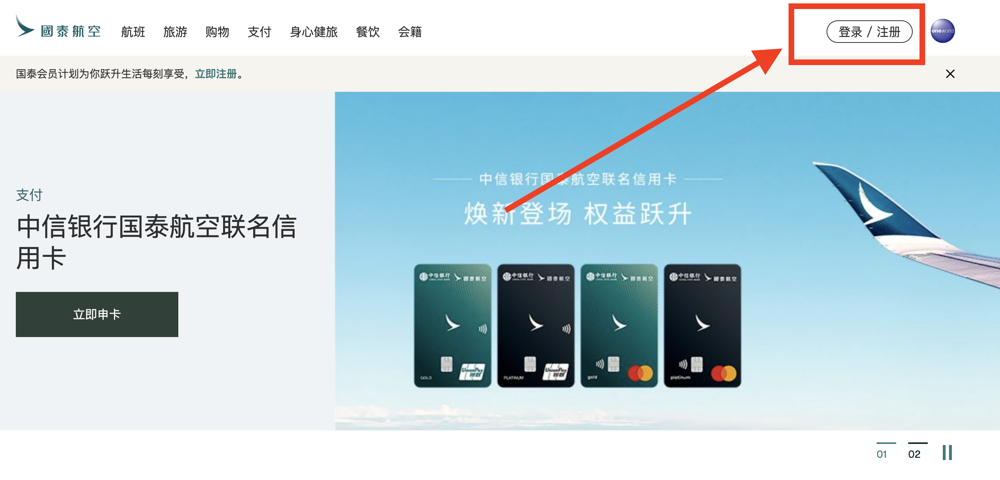
- 键入登陆信息
  - 国家：+86
  - 手机号码：18144350823
  - 密码：***catByd54611

    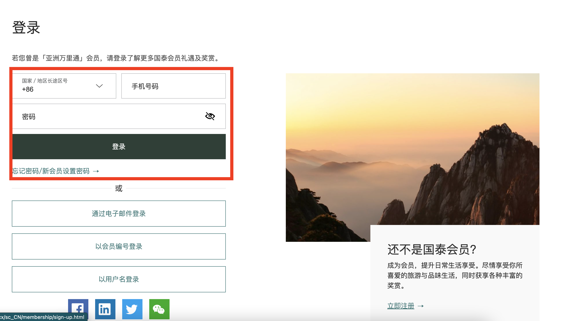
- 登陆后会自动返回主界面，右上角应现实“Li先生”
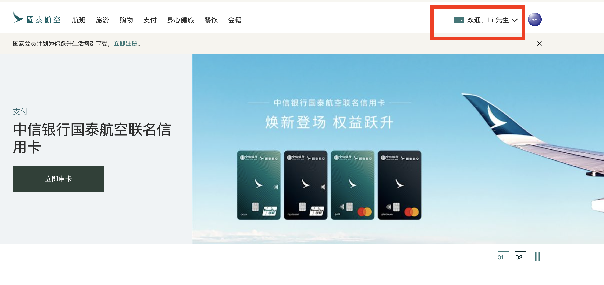

## 2.搜索机票
第二步为搜索机票
- 在登陆返回主页面后，略微向下划，找到“预定行程”板块并键入以下信息 

    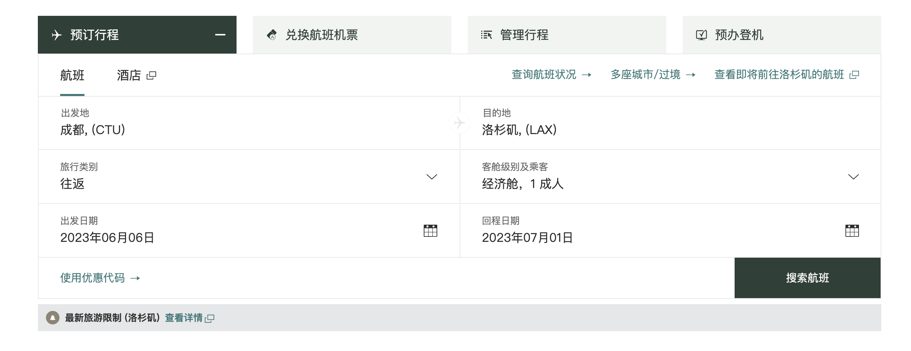
- 搜索后应得到如下界面
  
    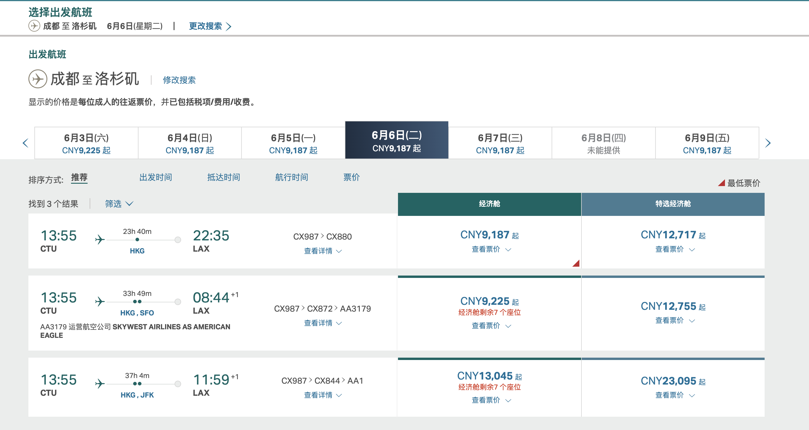

## 3.选择机票
- 选择去程机票
  - 在航线为`CX987>CX880`的选项中选择`经济舱`
  - 在弹出的三个舱位选择中选择`轻简`

    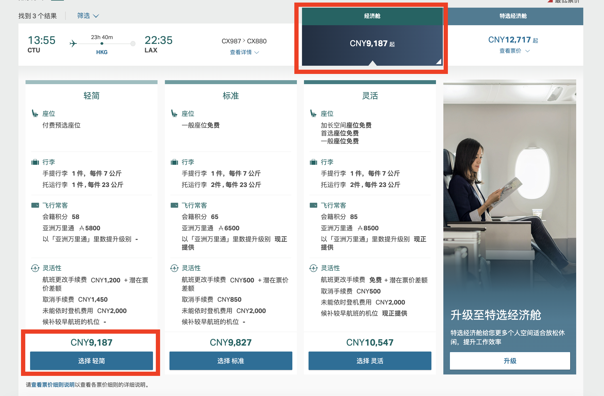
- 选择回程机票
  - 同样的，在航线为`CX881>CX986`的选项中选择`经济舱`
  - 在弹出的三个舱位选择中选择`轻简`

     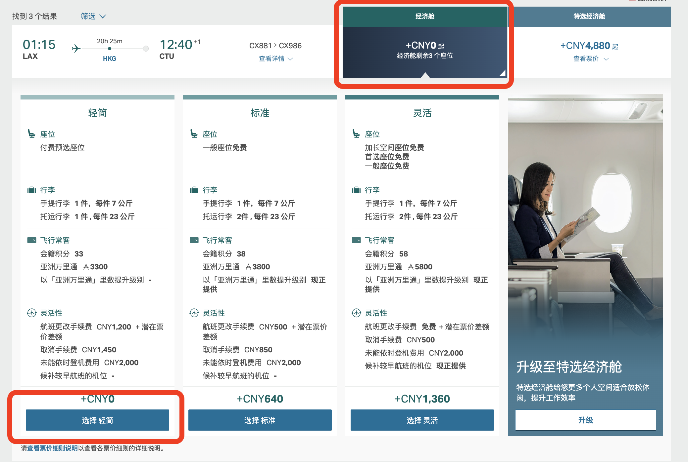
- 确认选择
  - 在本页面，选择`继续`∏
  
    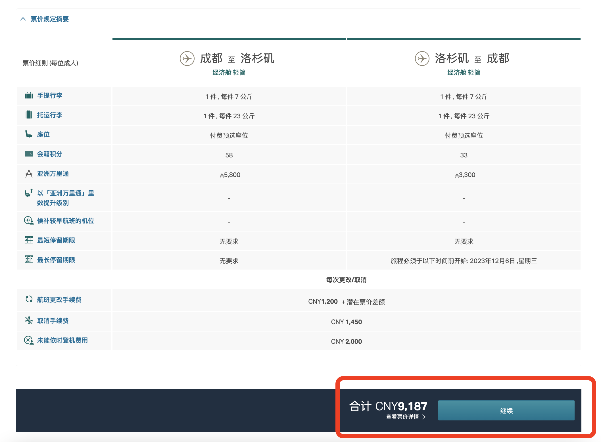

## 4.完成乘客信息
- 乘客信息
  - 更改乘客信息使其与下图一致
    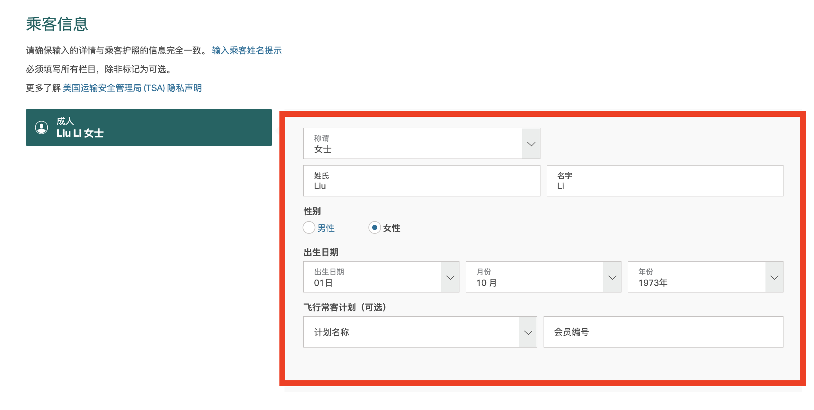
  - 务必将`飞行常客计划（可选）`内容更改为`计划名称`并删除原本`会员编号`
- 联系信息
  - 联系信息不必更改，保持与下图一致即可（你要是想改也没问题不重要）
    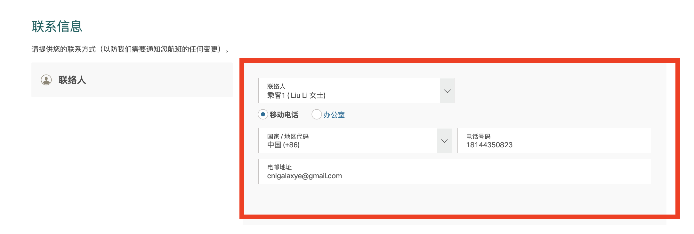
- 确认信息
  - 点击确认后会进入确认信息界面，点击`直接付款`
    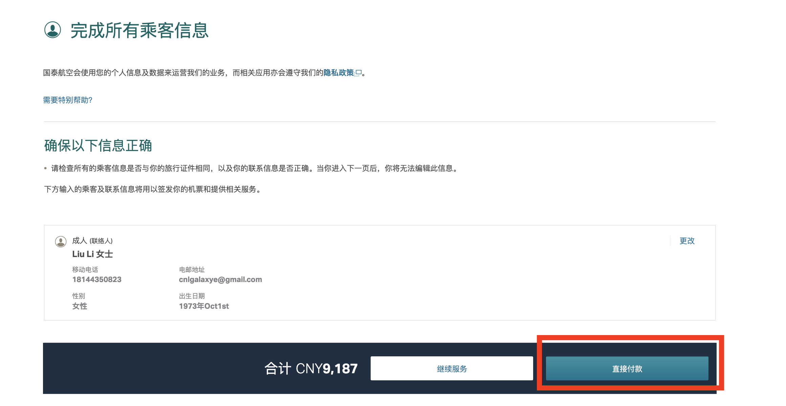
## 5.付款
- 在`里数加现金付款选项`，点击`确认数额`
  - 务必不要使用点数
  - 确保付款金额没有任何变动

    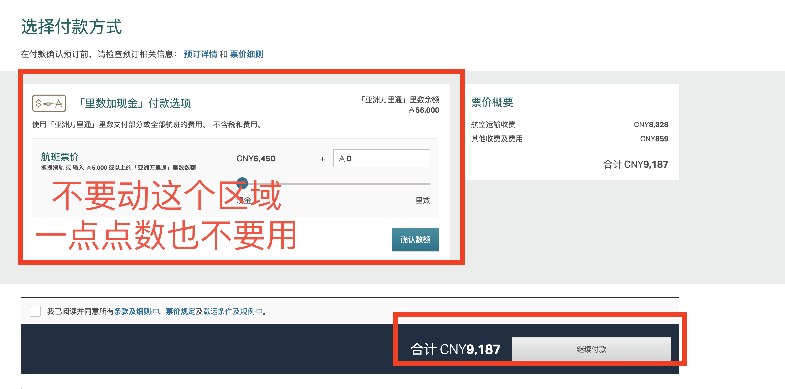
- 选择你喜欢的付款方式，勾选用户协议后点击继续付款

    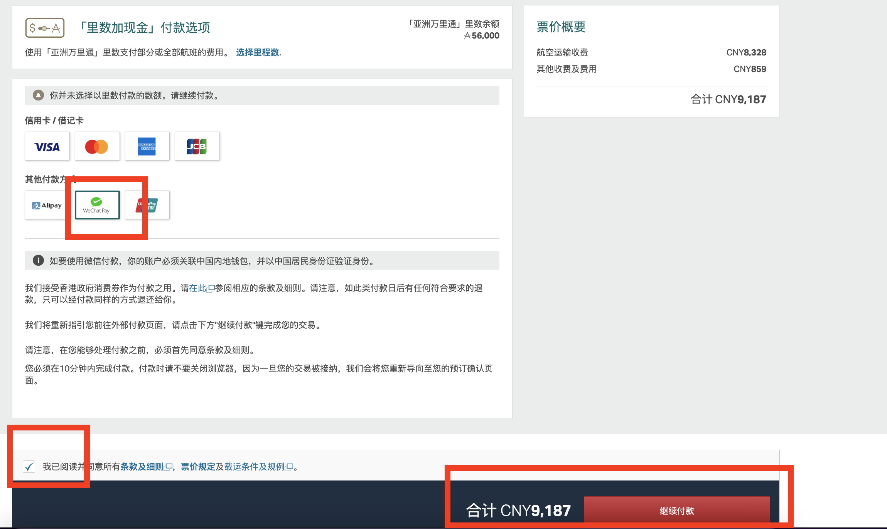
- 在弹出的付款界面中完成付款