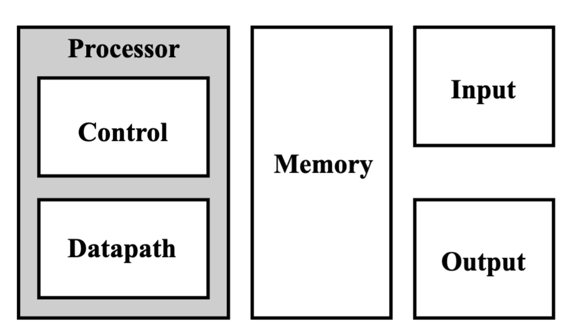
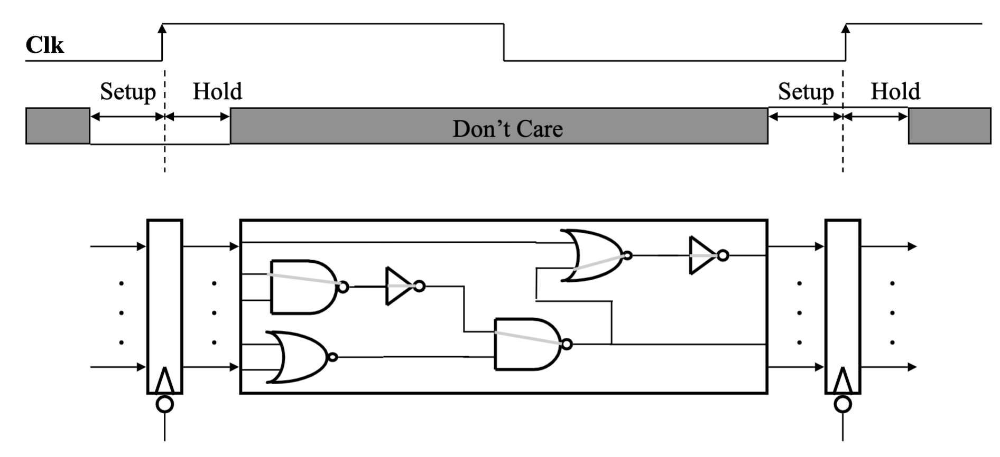
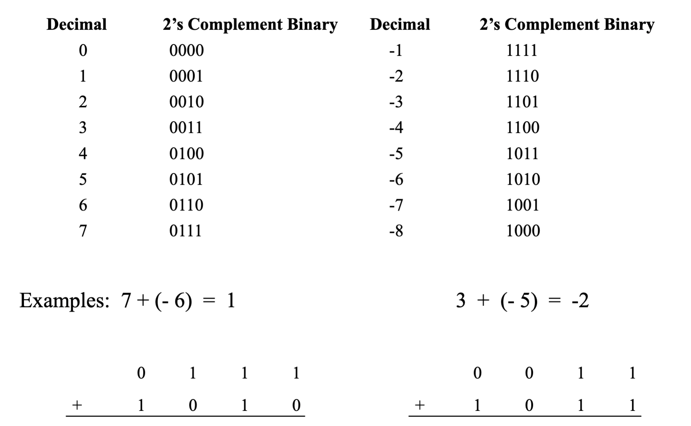
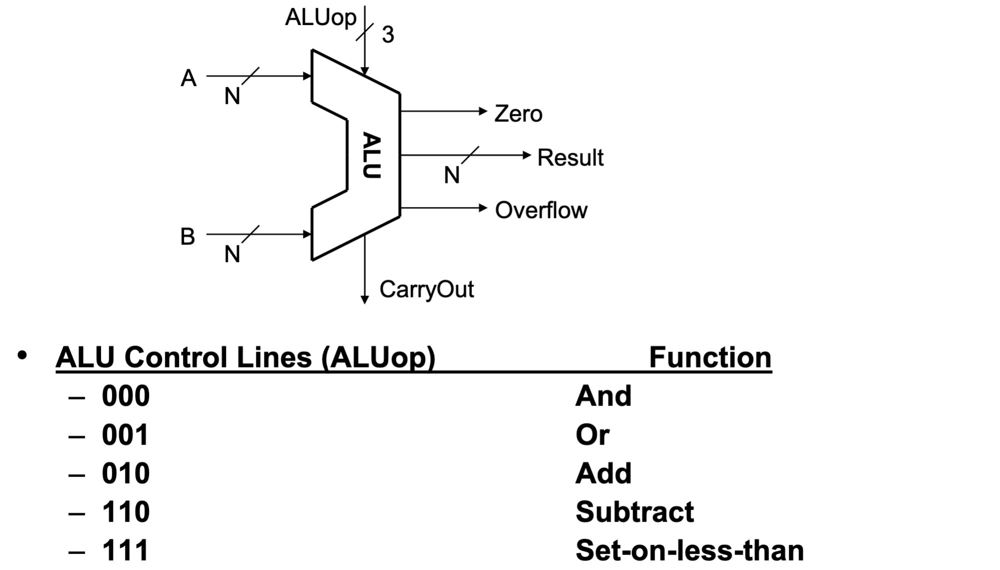
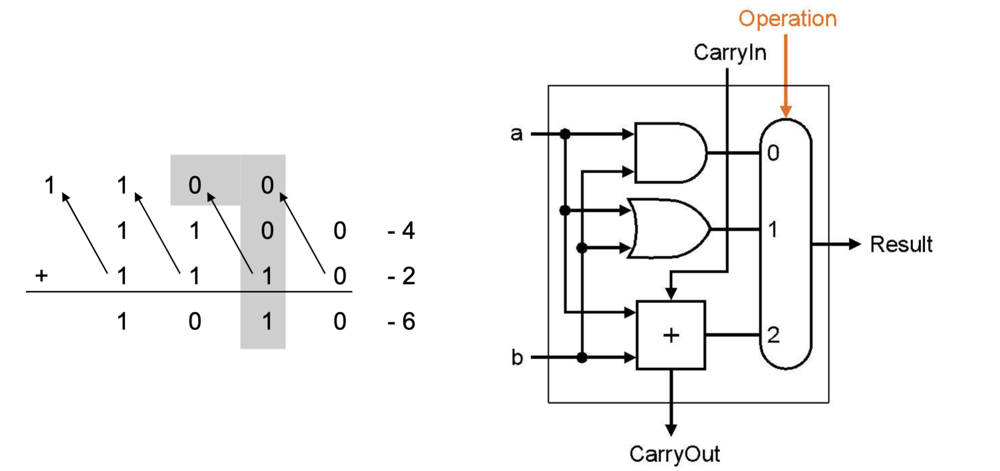

# TOC
# Meta
# Main
## Components of a Computer

- Control
- Datapath
- Memory
- Input
- Output

## The Performance Perspective
- Processor design (datapath and control) will determine:
    - Clock cycle time
    - Clock cycles per instruction
-  Single cycle processor:
    - Advantage: One clock cycle per instruction
    - Disadvantage: long cycle time

## Clocking Methodology
- All storage elements are clocked by the same clock edge
- This picture is valid whether we’re talking about a single-cycle 
processor, multi-cycle processor, pipelined processor, ...

## The Processor:  Datapath & Control
- We’re going to look at an implementation of MIPS simplified to 
contain only:
    - memory-reference instructions:  lw, sw
    - arithmetic-logical instructions:  add, sub, and, or, slt
    - control flow instructions:  beq
- Generic Implementation:
    - use the program counter (PC) to supply instruction address
    - get the instruction from memory
    - read registers
    - use the instruction to decide exactly what to do

## 2’s complement
- We would like a number systemthat provides
    - obvious representation of 0,1,2...
    - uses an adder for both unsigned and signed addition
    - single value of 0
    - equal coverage of positive and negative numbers
    - easy detection of sign
    - easy negation
- 2’s complement representation of negative numbers
  - Take the bitwise inverse and add 1
- Biggest 4-bit Binary Number: 7 Smallest 4-bit Binary Number: -8
  

## Execute: Arithmetic

### ALU: Arithmetic Logic Unit
  
### A One Bit ALU
- This 1-bit ALU will perform AND, OR, and ADD for a single bit 
position.
