# TOC
- [TOC](#toc)
- [Idea of Computer Architecture](#idea-of-computer-architecture)
  - [Hardware Designer vs. Computer Architect](#hardware-designer-vs-computer-architect)
  - [Computer Architecture](#computer-architecture)
  - [The Instruction Set Architecture](#the-instruction-set-architecture)
  - [Computer Organization](#computer-organization)
- [ISA](#isa)
  - [Brief Vocabulary Lesson](#brief-vocabulary-lesson)
  - [The Instruction Execution Cycle](#the-instruction-execution-cycle)
  - [ISA decisions](#isa-decisions)
    - [Instruction Length](#instruction-length)
    - [Instruction Formats](#instruction-formats)
    - [Accessing the Operands](#accessing-the-operands)
    - [Which instructions?](#which-instructions)
    - [Control Flow](#control-flow)
  - [Basic ISA Classes](#basic-isa-classes)
    - [Accumulator](#accumulator)
    - [Stack](#stack)
    - [General Purpose Register](#general-purpose-register)
    - [Load/Store](#loadstore)
    - [MISP Operands](#misp-operands)
  - [Instruction Execution in a CPU](#instruction-execution-in-a-cpu)
  - [Example from C to ASM](#example-from-c-to-asm)
  - [RISC Architectures](#risc-architectures)
  - [RISC-V](#risc-v)
  - [Alternative Architectures](#alternative-architectures)
- [Time and Performance](#time-and-performance)
  - [Performance](#performance)
    - [Measures of “Performance”](#measures-of-performance)
    - [How to measure Execution Time?](#how-to-measure-execution-time)
    - [Relative Performance](#relative-performance)
  - [Time](#time)
    - [What is Time?](#what-is-time)
    - [How many clock cycles?](#how-many-clock-cycles)
  - [Amdahl’s Law](#amdahls-law)
- [Single Cycle DataPath](#single-cycle-datapath)
  - [Components of a Computer](#components-of-a-computer)
  - [The Performance Perspective](#the-performance-perspective)
  - [Clocking Methodology](#clocking-methodology)
  - [The Processor:  Datapath \& Control](#the-processor--datapath--control)
  - [2’s complement](#2s-complement)
  - [Execute: Arithmetic](#execute-arithmetic)
    - [ALU: Arithmetic Logic Unit](#alu-arithmetic-logic-unit)
    - [A One Bit ALU](#a-one-bit-alu)
    - [A 32-bit ALU](#a-32-bit-alu)
    - [Subtraction](#subtraction)
    - [Full ALU](#full-alu)
    - [The Disadvantage of Ripple Carry](#the-disadvantage-of-ripple-carry)
  - [Floating Point](#floating-point)
  - [RTL: Register Transfer Language](#rtl-register-transfer-language)
  - [Review:  The MIPS Instruction Formats](#review--the-mips-instruction-formats)
  - [Storage elements](#storage-elements)
    - [Storage Element: Register](#storage-element-register)
  - [Putting it All Together: A Single Cycle Datapath](#putting-it-all-together-a-single-cycle-datapath)
  - [key Points](#key-points)
  - [Control Signal](#control-signal)
    - [ALU Control](#alu-control)
    - [Control](#control)
  - [Single-Cycle CPU Summary](#single-cycle-cpu-summary)


# Idea of Computer Architecture
## Hardware Designer vs. Computer Architect
- Hardware Designer
    - thinks about circuits, 
components, timing, 
functionality, ease of 
debugging
    - “construction engineer”

- Computer Architect
    - thinks about high-level  components, how they fit 
together, how they work 
together to deliver 
performance.
    - “building architect”
- Why care?
    - You may actually do computer architecture someday
    - You may actually care about software performance 
someday
        - The ability of application programs, compilers, operating systems, etc. 
to deliver performance depends critically on an understanding of the 
underlying computer organization.
        - That becomes more true every year.
          - Up until about 10 years ago, that was primarily due to the increasing 
complexity of the core microarchitecture
         - Since, it is more about the reliance on hardware parallelism and hardware 
heterogeneity
    - You may actually care about computer security
        - Most of the newest and most insidious security attacks have focused 
on microarchitectural details.

## Computer Architecture
- Computer Architecture =
Machine Organization  + 
Instruction Set Architecture
    - Machine Organization: What the machine 
hardware looks like
    - Instruction Set Architecture: How you talk to the machine
- How to Speak Computer


## The Instruction Set Architecture
- that part of the architecture that is visible to the 
programmer
    - opcodes (available instructions)
    - number and types of registers
    - instruction formats
    - storage access, addressing modes
    - exceptional conditions
- It is the agreed-upon interface between all the software that runs on the 
machine and the hardware that executes it.

- The Instruction Execution Cycle
  1. Instruction
Fetch: Obtain instruction from program storage
    2. Instruction
Decode: Determine required actions and instruction size
    3. Operand
Fetch: Locate and obtain operand data
    4. Execute: Compute result value or status
    5. Result
Store: Deposit results in storage for later use
    6. Next
Instruction: Determine successor instruction
- Key ISA decisions
    - operations
      - how many?
      - which ones
    - operands
      - how many?
      - location
      - types
      - how to specify?
    - instruction format 
      - size
      - how many formats?


## Computer Organization
- Once you have decided on an ISA, you must decide how to 
design the hardware to execute those programs written in 
the ISA as fast as possible (or as cheaply as possible, or 
using as little power as possible, ...). 
- This must be done every time a new implementation of the 
architecture is released, with typically very different 
technological constraints.

# ISA

## Brief Vocabulary Lesson
- parallelism -- the ability to do more than one thing at once.
- superscalar processor -- can execute more than one 
instruction per cycle.
- cycle -- smallest unit of time in a processor.
- pipelining -- overlapping parts of a large task to increase 
throughput without decreasing latency


## The Instruction Execution Cycle
1. Instruction
Fetch: Obtain instruction from program storage
1. Instruction
Decode: Determine required actions and instruction size
1. Operand
Fetch: Locate and obtain operand data
 1. Execute: Compute result value or status
 2. Result
Store: Deposit results in storage for later use
 1. Next
Instruction: Determine successor instruction

## ISA decisions
### Instruction Length
- Variable-length instructions (Intel 80x86, VAX) require 
multi-step fetch and decode, but allow for a much more 
flexible and compact instruction set.
- Fixed-length instructions allow easy fetch and decode, and 
simplify pipelining and parallelism.
- All MIPS instructions are 32 bits long.
    - this decision impacts every other ISA decision we make because it 
makes instruction bits scarce.
### Instruction Formats
>what does each bit mean?
- Having many different instruction formats...
    - complicates decoding 
    - uses more instruction bits (to specify the format)
    - Could allow us to take full advantage of a variable-length ISA
    
### Accessing the Operands
- operands are generally in one of two places:
    - registers (32 int, 32 fp)
    - memory (232 locations) 
- registers are
    - easy to specify
    - close to the processor (fast access)
- the idea that we want to access registers whenever possible 
led to load-store architectures.
    - normal arithmetic instructions only access registers
    - only access memory with explicit loads and stores
- Load-store architectures
  - Can Do
    ```asm
    add r1=r2+r3
    load r3, M(address)
    ```
  - Can't Do
    ```asm
    add r1 = r2 + M(address)
    ```
  - forces heavy dependence on 
registers, which is exactly what 
you want in today’s CPUs
  - more instructions
  - fast implementation (e.g., easy 
pipelining)
- How Many Operands?
    -  Most instructions have three operands (e.g., z = x + y).
    - Well-known ISAs specify 0-3 (explicit) operands per 
instruction.
    - Operands can be specified implicitly or explicity.
- Addressing Modes
  >how do we specify the operand we want?

  | Mode | Example | 
  | --- | --- |
  |Register direct| R3|
  |Immediate |(literal) #25
  | Direct (absolute)| M[10000]
  | Register indirect | M[R3]
  | Base+Displacement |M[R3 + 10000]
  | Base+Index| M[R3 + R4]
  | Scaled Index |M[R3 + R4*d + 10000]
  | Autoincrement |M[R3++]
  | Autodecrement |M[R3 - -]
  | Memory Indirect| M[ M[R3] ]'
- MIPS addressing modes
  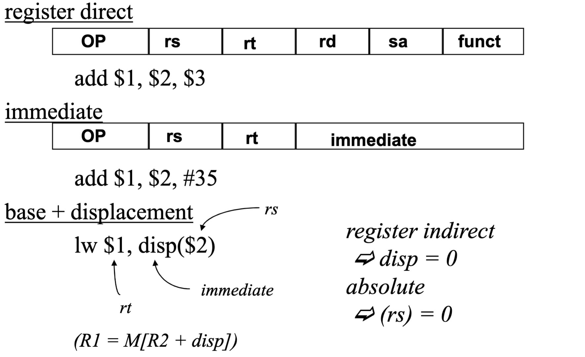
- Is this sufficient?
    - measurements on the VAX (super complex ISA) show that 
these addressing modes (immediate, direct, register 
indirect, and base+displacement) represent 88% of all 
addressing mode usage. 
    - similar measurements show that 16 bits is enough for the 
immediate 75 to 80% of the time
    - and that 16 bits is enough of a displacement 99% of the 
time.
    - (and when these are not sufficient, it typically means we 
need one more instruction)
- Memory Organization (digression)
  - Viewed as a large, single-dimension array, with an address.
  - A memory address is an index into the array
  - "Byte addressing" means that the index (address) points to a 
byte of memory.
  - Bytes are nice, but most data items use larger "words"
  - For MIPS32, a word is 32 bits or 4 bytes.
  - If addresses are 32 bits, then we can think of memory as
    - 232 bytes with byte addresses from 0, 1, to 232-1
    - 230 words with byte addresses 0, 4, 8, ... 232-4
  - Words are aligned
    - i.e., what are the  least 2 significant bits of a word 
address?
  - (The MIPS64 ISA, however, has 64-bit registers)
### Which instructions?
- arithmetic
  - add, subtract, multiply, divide
- logical
  - and, or, shift left, shift right
- data transfer
  - load word, store word
- conditional branch
- unconditional jump
### Control Flow
- Jumps
  - need to be able to jump to an absolute address sometimes
  - need to be able to do procedure calls and returns
  - jump 
    - j 10000  => PC = 10000
  - jump and link
    - jal 100000 => $31 = PC + 4; PC = 10000
    - used for procedure calls
  - jump register
    - jr $31 => PC = $31
    - used for returns, but can be useful for lots of other things.
- Procedure call (jump subroutine)
- Conditional Branch
- Used to implement, for example, if-then-else logic, loops, etc.
    - A conditional branch must specify two things
    - How do you specify the destination (target) of a 
branch/jump?
    - studies show that almost all conditional branches go short 
distances from the current program counter (loops, if-then-
else).
        - we can specify a relative address in much fewer bits than an 
absolute address
        - e.g., beq $1, $2, 100    => if ($1 == $2) PC = (PC+4) + 100 * 4
    - MIPS conditional branches
      - beq, bne 
        - beq r1, r2, addr => if (r1 == r2) goto addr
      - slt
        - slt $1, $2, $3  =>  if ($2 < $3) $1 = 1; else $1 = 0
      - these, combined with $0, can implement all fundamental 
branch conditions
- Condition under which the branch is taken 
- Location that the branch jumps to if taken (target)
- Branch and Jump Addressing Modes
  - Branch (e.g., beq) uses PC-relative addressing mode (uses 
few bits if address typically close).  That is, it uses 
base+displacement mode, with the PC being the base.  If 
opcode is 6 bits, how many bits are available for 
displacement?  How far can you jump?
  - Jump uses pseudo-direct addressing mode.  26 bits of the 
address is in the instruction, the rest is taken from the PC.

## Basic ISA Classes
### Accumulator
| Number of address | Syntex | Exaplanation |
| --- | --- | ---|
| 1 | add A | acc <- acc + mem[A]

### Stack
| Number of address | Syntex | Exaplanation |
| --- | --- | ---|
| 0 | add | tos <- tos + next |

### General Purpose Register
| Number of address | Syntex | Exaplanation |
| --- | --- | ---|
| 2 | add A B | EA(A) <- EA(A) + EA(B)|
| 3 | add A B C | EA(A) <- EA(B) + EA(C)|

### Load/Store
| Number of address | Syntex | Exaplanation |
| --- | --- | ---|
|3(restricted) | add Ra Rb Rc | Ra <- Rb + Rc|
|3(restricted) | load Ra Rb | Ra <- mem[Rb]|
|3(restricted) | store Ra Rb | mem[Rb] <- Ra|

### MISP Operands


## Instruction Execution in a CPU
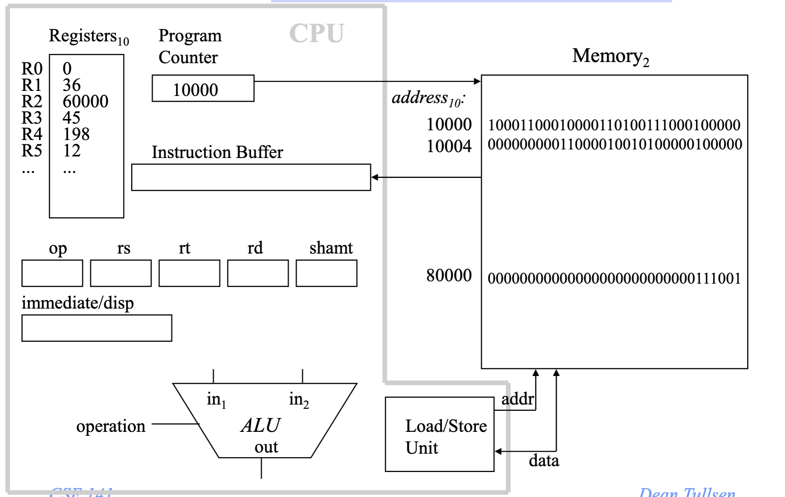

## Example from C to ASM
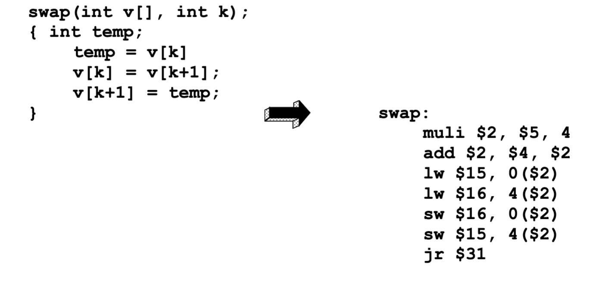

## RISC Architectures
- MIPS, like SPARC, PowerPC, and Alpha AXP, is a RISC (Reduced 
Instruction Set Computer) ISA.
    - fixed instruction length
    - few instruction formats
    -  load/store architecture
  - RISC architectures worked because they enabled pipelining. They 
continue to thrive because they enable parallelism.

## RISC-V
- MIPS was the commercialization of the Berkeley RISC project (ie, 
RISC-I).  While MIPS is no longer an important ISA, the original 
RISC (now RISC-V) has been resurrected and may be one of the most 
important ISAs going forward.
    - Public domain
    - Crowd sourced design, software, etc.

## Alternative Architectures
- Design alternative:
    - provide more powerful operations
    - goal is to reduce number of instructions executed
    - danger is a slower cycle time and/or a higher CPI (cycles per 
instruction)
- Sometimes referred to as “RISC vs. CISC”
    - CISC = Complex Instruction Set Computer (as alt to RISC)
    - virtually all new instruction sets since 1982 have been RISC
    - VAX:  minimize code size, make assembly language easy
instructions from 1 to 54 bytes long!
- PowerPC
    - Indexed addressing
      ```asm
      lw $t1,$a0+$s3  #$t1=Memory[$a0+$s3] 
      ```
    - Update addressing
        - update a register as part of load (for marching through arrays)
      ```asm
      lwu $t0,4($s3) #$t0=Memory[$s3+4];$s3=$s3+4
    - Others:
        - load multiple/store multiple
        -  a special counter register  “bc Loop”   
            - decrement counter, if not 0 goto loop
 - 80x86
    - 1978:  The Intel 8086 is announced (16 bit architecture)
    - 1980:  The 8087 floating point coprocessor is added
    - 1982:  The 80286 increases address space to 24 bits, +instructions
    - 1985:  The 80386 extends to 32 bits, new addressing modes
    - 1989-1995:  The 80486, Pentium, Pentium Pro add a few  instructions
(mostly designed for higher performance)
    - 1997:  MMX is added
    - 1999: Pentium III (same architecture)
    - 2001: Pentium 4 (144 new multimedia instructions), simultaneous 
multithreading (hyperthreading)
    - 2005: dual core Pentium processors
    - 2006: quad core (sort of) Pentium processors
    - 2009: Nehalem – eight-core multithreaded (SMT) processors
    - 2015: Skylake – multicore, multithreaded, added hw security features, 
transactional memory, ...
    - 2021 Alder Lake – heterogeneous multicore, multithreaded.
    - Complexity:
      - Instructions from 1 to 17 bytes long
      - one operand must act as both a source and destination
      - one operand can come from memory
      - complex addressing modes
        - e.g., “base or scaled index with 8 or 32 bit displacement”
    - Saving grace:
        - the most frequently used instructions are not too difficult to build
        - compilers avoid the portions of the architecture that are slow
        - Some other tricks we’ll talk about later.
- Key Points
    - MIPS is a general-purpose register, load-store, fixed-
instruction-length architecture.
    - MIPS is optimized for fast pipelined performance, not for 
low instruction count
    - Historic architectures favored code size over parallelism.
    - MIPS most complex addressing mode, for both branches 
and loads/stores is base + displacement.

# Time and Performance
## Performance
### Measures of “Performance”
- Execution Time
- Frame Rate
- Throughput (operations/time)
- Transactions/sec, queries/day, etc.
- Responsiveness
- Performance / Cost
- Performance / Power 
- Performance / Energy

### How to measure Execution Time?
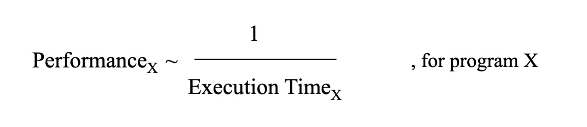
- only has meaning in the context of a program or workload
- Not very intuitive as an absolute measure, but most of the 
time we’re more interested in relative performance.

### Relative Performance
- can be confusing
  ```
  A runs in 12 seconds
  B runs in 20 seconds
  – A/B = .6 , so A is 40% faster, or 1.4X faster, or B is 40% slower
  – B/A = 1.67, so A is 67% faster, or 1.67X faster, or B is 67% 
  slower
  ```
- needs a precise definition
- Relative Performance (Speedup), the 
Definition
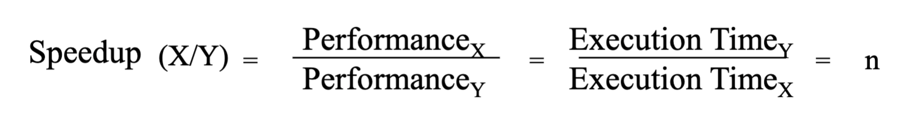

## Time
### What is Time?
- CPU Execution Time = CPU clock cycles * Clock cycle time
  - Every conventional processor has a clock with an associated clock 
cycle time or clock rate
  - Every program runs in an integral number of clock cycles
  - Cycle Time
    - GHz = billions of cycles/second
    - MHz = millions of cycles/second
    - Y GHz = 1/Y nanoseconds cycle time
### How many clock cycles?
- Number of CPU clock cycles = Instruction count * Average 
Clock Cycles per Instruction (CPI)

## Amdahl’s Law
- The impact of a performance improvement is limited by 
the fraction of execution time affected by the improvement
- Make the common case fast!!         (usually)
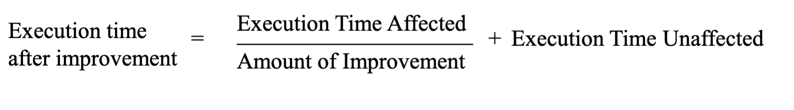


# Single Cycle DataPath
## Components of a Computer

- Control
- Datapath
- Memory
- Input
- Output

## The Performance Perspective
- Processor design (datapath and control) will determine:
    - Clock cycle time
    - Clock cycles per instruction
-  Single cycle processor:
    - Advantage: One clock cycle per instruction
    - Disadvantage: long cycle time

## Clocking Methodology
- All storage elements are clocked by the same clock edge
- This picture is valid whether we’re talking about a single-cycle 
processor, multi-cycle processor, pipelined processor, ...


## The Processor:  Datapath & Control
- We’re going to look at an implementation of MIPS simplified to 
contain only:
    - memory-reference instructions:  lw, sw
    - arithmetic-logical instructions:  add, sub, and, or, slt
    - control flow instructions:  beq
- Generic Implementation:
    - use the program counter (PC) to supply instruction address
    - get the instruction from memory
    - read registers
    - use the instruction to decide exactly what to do

## 2’s complement
- We would like a number systemthat provides
    - obvious representation of 0,1,2...
    - uses an adder for both unsigned and signed addition
    - single value of 0
    - equal coverage of positive and negative numbers
    - easy detection of sign
    - easy negation
- 2’s complement representation of negative numbers
  - Take the bitwise inverse and add 1
- Biggest 4-bit Binary Number: 7 Smallest 4-bit Binary Number: -8
  

## Execute: Arithmetic

### ALU: Arithmetic Logic Unit
  
### A One Bit ALU
- This 1-bit ALU will perform AND, OR, and ADD for a single bit 
position.

### A 32-bit ALU
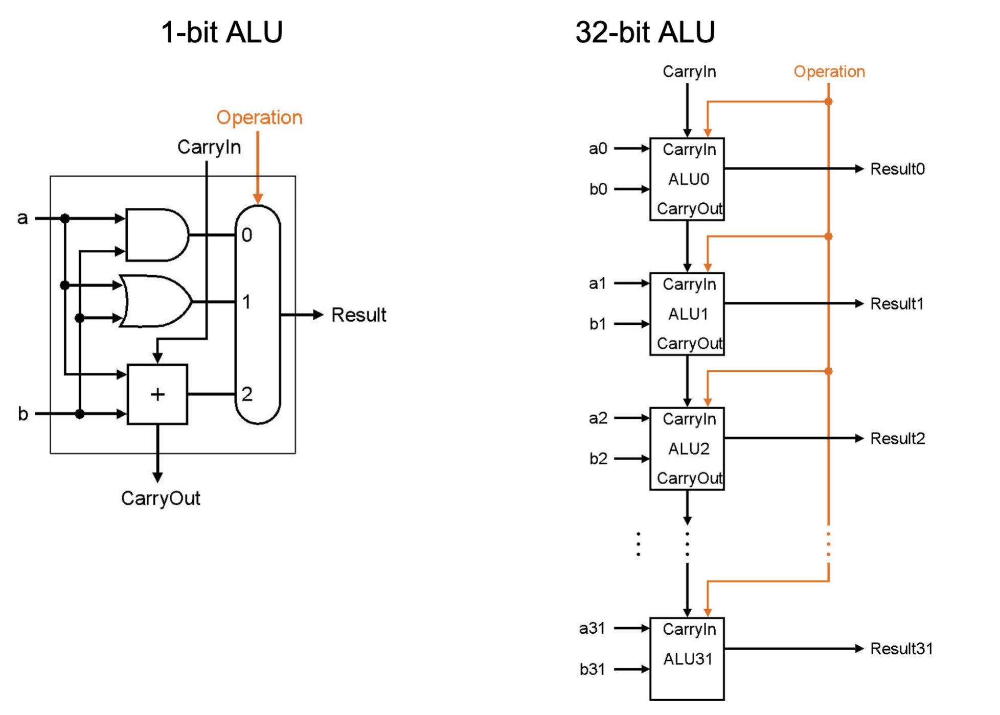
### Subtraction
- Keep in mind the following:
    - (A - B) is the same as: A + (-B)
    - 2’s Complement negate: Take the inverse of every bit and add 1
- Bit-wise inverse of B is !B:
    - A - B = A + (-B) = A + (!B + 1) = A + !B + 1 
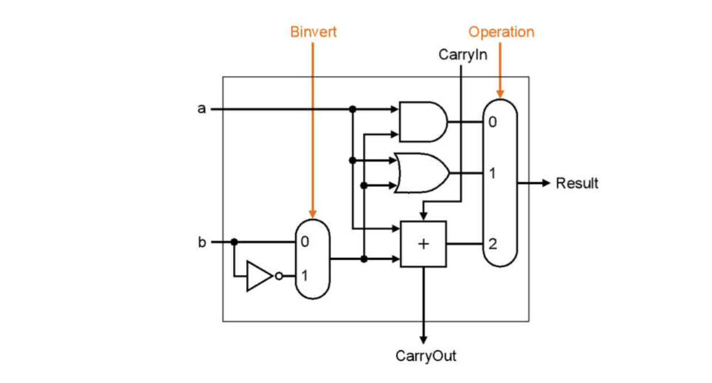
### Full ALU
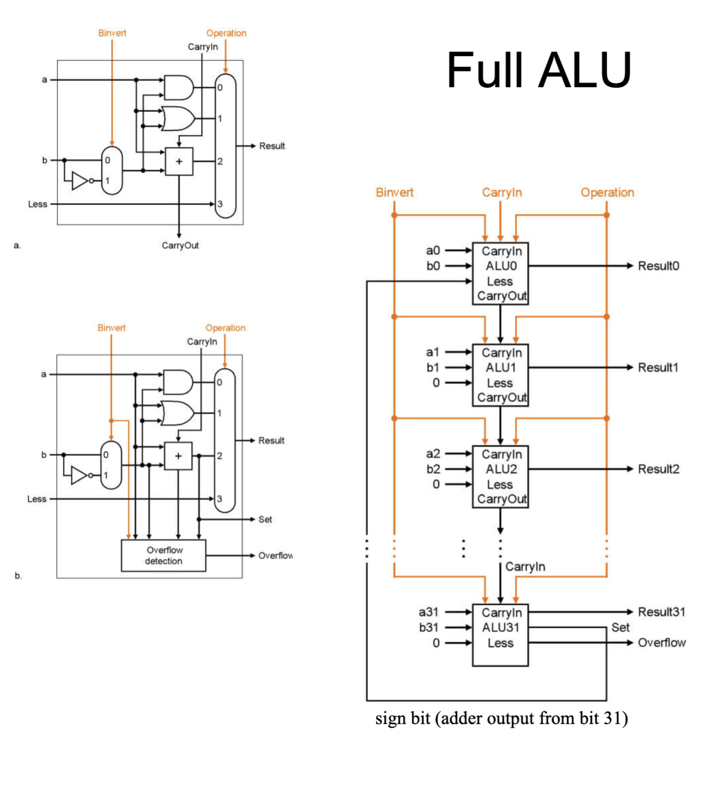
### The Disadvantage of Ripple Carry
- The adder we just built is called a “Ripple Carry Adder”
  - The carry bit may have to propagate from LSB to MSB
  - Worst case delay for an N-bit RC adder: 2N-gate delay
- The point -> ripple carry adders are slow.  Faster addition schemes are 
possible that acceleratethe movement of the carry from one end to the other.

## Floating Point
- Typically will have their own ALU (and register file!)
- Because they require normalization, then math, then 
renormalization, then rounding (a lot of serialized steps)...
- FP computations are always slower than integer.
    - Eg, Skylake
    ```asm
    Int add 1, int mul 4, FP add 3, FP mul 5
    ```
## RTL: Register Transfer Language
- It is a mechanism for describing the movement and 
manipulation of data between storage elements:
  ```asm
  R[3] <- R[5] + R[7]
  PC <- PC + 4 + R[5]
  R[rd] <- R[rs] + R[rt]
  R[rt] <- Mem[R[rs] + immed]
  ```
## Review:  The MIPS Instruction Formats
All MIPS instructions are 32 bits long.  The three  instruction formats:

- R-type
    - add rd, rs, rt
    - sub, and, or, slt
- LOAD and STORE
    - lw rt, rs, imm16
    -  sw rt, rs, imm16
- BRANCH:
    -  beq rs, rt, imm16
## Storage elements
- RTL describes data movement between storage elements, 
but we don’t actually have our data elements yet.
### Storage Element: Register
- Register
  - Similar to the D Flip Flop except
    -  N-bit input and output
    - Write Enable input
  - Write Enable:
     - 0: Data Out will not change
    - 1: Data Out will become Data In (on the clock edge)
- But we need a whole bunch of registers
  - Register File

## Putting it All Together: A Single Cycle Datapath
- We have everything except control signals (later)


## key Points
- CPU is just a collection of state and combinational logic
- We just designed a the datapath for a very rich processor, 
at least in terms of functionality
- ET = IC * CPI * Cycle Time
- where does the single-cycle machine fit in?

## Control Signal
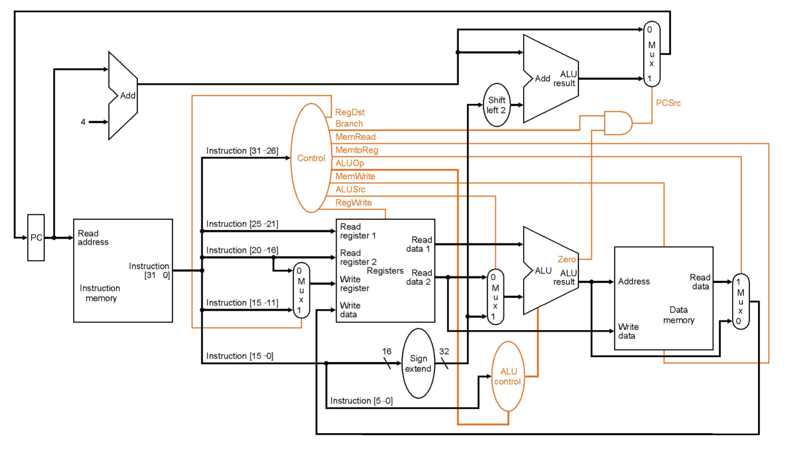
### ALU Control

- Generating ALU control
  
  | Instruction opcode | ALUOp | Instruction operation | Function code | Desired ALU action | ALU control input|
  | --- | --- | --- | --- | --- | --- |
  |lw| 00 |load word| xxxxxx| add| 010
  |sw |00 |store word |xxxxxx |add |010
  |beq |01| branch eq |xxxxxx |subtract| 110
  |R-type |10| add |100000| add |010
  |R-type |10 |subtract |100010| subtract |110
  |R-type |10 |AND |100100| and| 000
  |R-type |10 |OR |100101 |or |001
  |R-type| 10 |slt| 101010| slt| 111
- logic equations
    - ALUctr2 = (!ALUop1 & ALUop0) | (ALUop1 & Func1)
    - ALUctr1 = !ALUop1 | (ALUop1 & !Func2) 
    - ALUctr0 =ALUop1 & (Func0 | Func3)
- Control Truth Table
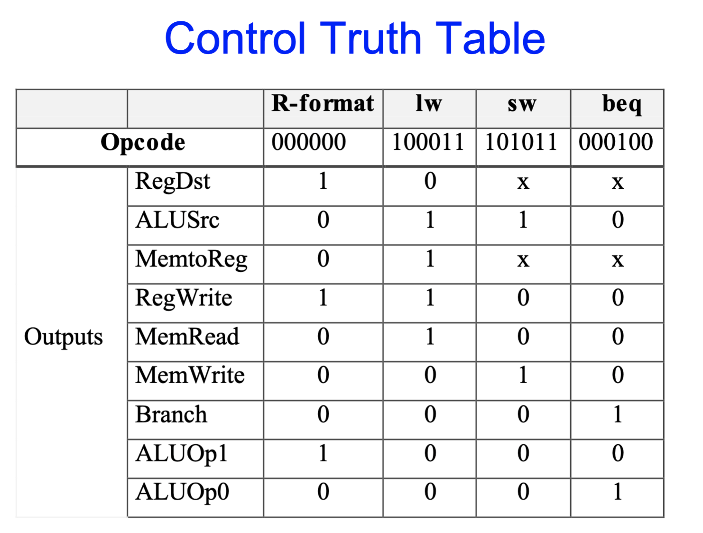
### Control
- Simple combinational logic (truth tables)
- And again, just in case you wanted to see the logic:
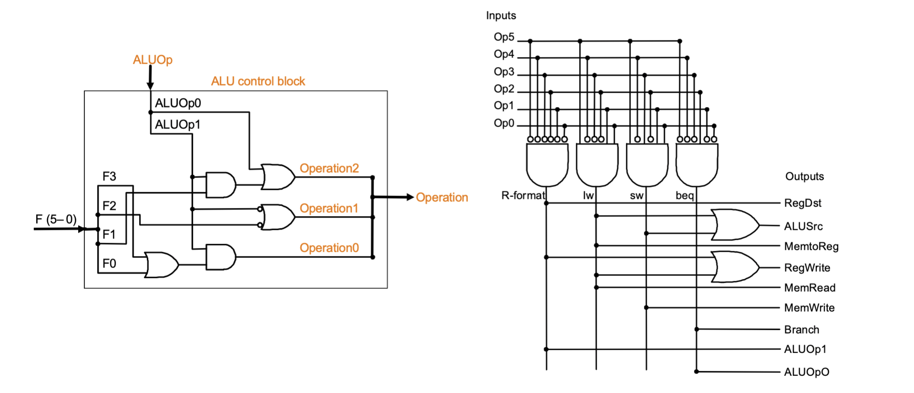

## Single-Cycle CPU Summary
- Easy, particularly the control
- Which instruction takes the longest?  By how much?  Why 
is that a problem?
- ET = IC  *  CPI  *  CT
- What else can we do?
- When does a multi-cycle implementation make sense?
– e.g., 70% of instructions take 75 ns, 30% take 200 ns?
– suppose 20% overhead for extra latches
- Real machines have much morevariable instruction 
latencies than this.